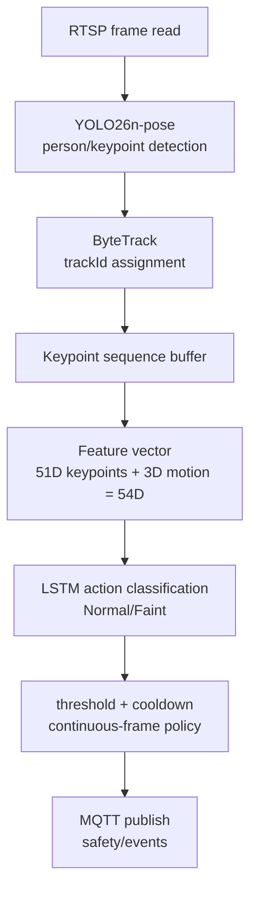

## 목적

RTSP 입력에서 MQTT 이벤트까지 이어지는 AI worker의 판단 흐름을 LLM과 개발자가 빠르게 복원할 수 있게 정리한다. 영상 취득, 사람 감지, 행동 분류, 이벤트 발행 각 단계의 역할과 연결 방식을 한 문서에서 확인할 수 있어야 한다.

## 배경

현재 AI 방향은 YOLO를 직접 재학습하는 것이 아니라 `YOLO26n-pose`로 사람의 bbox와 17개 COCO keypoint를 추출한 뒤, ByteTrack으로 track별 연속성을 유지하고, track별 keypoint sequence를 LSTM에 넣어 `Normal/Faint`를 판단하는 구조다.

이 접근은 frame 단위 단순 포즈 판단이 아니라 시간 맥락을 활용해 실신 이벤트를 구분한다는 점에서, 관제 서비스의 오탐·미탐 균형을 threshold 조정으로 유연하게 다룰 수 있다는 장점이 있다.

## 핵심 내용

AI 파이프라인은 다음 요소로 구성된다.

| Step | 역할 | 출력 |
| --- | --- | --- |
| RTSP reader | MediaMTX stream frame 읽기 | frame |
| YOLO26n-pose | 사람 bbox와 17개 COCO keypoint 추출 | bbox, keypoints |
| ByteTrack | frame 간 동일 인물 track 유지 | trackId |
| Keypoint sequence | track별 시간 순서 feature 구성 | `(sequenceLength, 51)` |
| LSTM | `Normal/Faint` 확률 산출 | class probability |
| Event decision | threshold, 연속 감지, cooldown 적용 | MQTT event |

최신 benchmark 기준 YOLO26n-pose는 threshold 0.5에서 Faint Recall `0.750877`, F1 `0.612303`, FN `142`다. 출처는 `.tmp/gpu_benchmark/lstm_extractor_comparison_fast/summary.csv`다.

## 쓰러짐 판단 기준 및 흐름 상세

이 프로젝트의 쓰러짐 판단은 단순히 Bounding Box가 누워 있는지 확인하는 단순 룰 기반이 아니라, **YOLO Pose + Tracking + LSTM Action Model**의 협업 파이프라인 결과를 기반으로 동작합니다.

### 1. 판단 흐름 (Decision Flow)

1. **YOLO26n-pose 검출**: 프레임마다 사람의 bbox 및 17개 COCO keypoint를 추출합니다.
2. **ByteTrack 추적**: 검출된 사람별로 고유한 `track_id`를 연속적으로 부여하고 유지합니다.
3. **Keypoint 시퀀스 구성**: 동일한 `track_id`를 가진 인물의 keypoint/bbox 특징들을 버퍼에 시간 순서대로 모읍니다.
4. **LSTM 분류**: 모인 시퀀스 데이터를 LSTM Action Model에 입력하여 `Normal` / `Faint` 의 Softmax 확률 값을 출력합니다.
5. **쓰러짐 후보(Faint Candidate) 판정**: LSTM이 판단한 `Faint` 확률이 임계값 이상인 경우, Faint 후보군으로 분류합니다.
6. **연속 감지 필터**: 같은 `track_id`를 가진 인물에게서 **연속 3번**의 Faint 후보 판정이 나와야 최종 쓰러짐 상황으로 간주합니다.
7. **카메라 쿨다운 적용**: 최종 감지 시 MQTT event를 발행하여 실시간 알림을 발생시키고, 중복 알림 방지를 위해 해당 카메라에는 **10초 쿨다운**을 적용합니다.

### 2. 기본 기준값 및 관련 코드 위치

| 기준 설정 항목 | 기본 설정값 | 역할 및 설명 | 소스 코드 위치 |
| :--- | :--- | :--- | :--- |
| **쓰러짐 확률 임계값<br>(Action Threshold)** | `0.3` | `Faint` 클래스 확률이 `0.3` 이상이어야 쓰러짐 후보로 판정합니다. (환경변수 `ACTION_THRESHOLD`로 오버라이드 가능) | [classifier.py:330](file:///C:/Users/user/ai-develop/ai/action/classifier.py#L330)<br>[faint_post_processing.py:1](file:///C:/Users/user/ai-develop/ai/action/faint_post_processing.py#L1) |
| **연속 감지 횟수<br>(Consecutive Count)** | `3` | 동일 track에서 연속 3프레임 이상 `Faint` 후보여야 알림을 발생시킵니다. | [faint_post_processing.py:2](file:///C:/Users/user/ai-develop/ai/action/faint_post_processing.py#L2) |
| **재알림 쿨다운<br>(Cooldown Seconds)** | `10초` | 동일 카메라에서 알림 발생 후 10초간 중복 알림을 차단합니다. | [faint_post_processing.py:3](file:///C:/Users/user/ai-develop/ai/action/faint_post_processing.py#L3) |
| **LSTM 시퀀스 길이** | `30` | LSTM 모델의 입력 시퀀스 윈도우 크기입니다. | [lstm_contract.py:6](file:///C:/Users/user/ai-develop/ai/action/lstm_contract.py#L6) |
| **시퀀스 stride** | `15` | 시퀀스 윈도우가 이동하는 간격(stride)입니다. | [lstm_contract.py:6](file:///C:/Users/user/ai-develop/ai/action/lstm_contract.py#L6) |

### 3. 실제 판정 논리 조건 요약

```text
Faint 확률 >= 0.3 (또는 $ACTION_THRESHOLD)
AND
동일한 track_id에서 연속 3회 감지
AND
카메라별 쿨다운 10초가 경과함
=> 최종 쓰러짐 알림 MQTT event 발행
```

## 입력

- `rtsp://<host>:8554/{cameraLoginId}`
- `YOLO26n-pose` checkpoint
- LSTM checkpoint
- `sequenceLength`, `stride`, `threshold`
- Backend camera registry와 일치하는 `cameraLoginId`

## 출력

- `Normal` 또는 `Faint` 판단
- confidence, bbox, trackId
- `safety/events` MQTT payload

## 동작 흐름



## 관련 파일

- `docs/AI_GUIDE.md`
- `docs/ai_training_preprocessing_summary.md`
- `strange_ai/.env.example`
- `.tmp/gpu_benchmark/lstm_extractor_comparison_fast/summary.csv`

## 관련 문서

- [LSTM](LSTM.md)
- [Model-Decision-YOLO26n](Model-Decision-YOLO26n.md)
- [AI-Output-JSON](AI-Output-JSON.md)
- [MQTT-Event-Schema](MQTT-Event-Schema.md)

## 주의사항

FP/FN clip은 단순 실패 로그가 아니라 다음 hard-negative와 missed Faint 보강 데이터의 출발점이다. threshold를 낮추면 recall은 올라가지만 알림 오탐이 늘 수 있다.

## 후속 작업

운영 RTSP smoke test에서 threshold 0.5와 0.6의 알림 품질을 비교하고, false positive clip을 hard-negative dataset으로 분류한다.

---
#ai #yolo26n #bytetrack #keypoint #lstm #threshold
