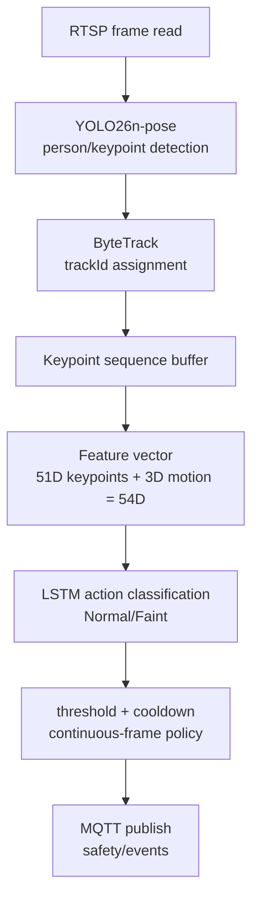

## 목적

RTSP 입력에서 MQTT 이벤트까지 이어지는 AI worker의 판단 흐름을 LLM과 개발자가 빠르게 복원할 수 있게 정리한다. 영상 취득, 사람 감지, 행동 분류, 이벤트 발행 각 단계의 역할과 연결 방식을 한 문서에서 확인할 수 있어야 한다.

## 배경

현재 AI 방향은 YOLO를 직접 재학습하는 것이 아니라 `YOLO26n-pose`로 사람의 bbox와 17개 COCO keypoint를 추출한 뒤, ByteTrack으로 track별 연속성을 유지하고, track별 keypoint sequence를 LSTM에 넣어 `Normal/Faint`를 판단하는 구조다.

이 접근은 frame 단위 단순 포즈 판단이 아니라 시간 맥락을 활용해 실신 이벤트를 구분한다는 점에서, 관제 서비스의 오탐·미탐 균형을 threshold 조정으로 유연하게 다룰 수 있다는 장점이 있다.

## 핵심 내용

AI 파이프라인은 다음 요소로 구성된다.

| Step | 역할 | 출력 |
| --- | --- | --- |
| RTSP reader | MediaMTX stream frame 읽기 | frame |
| YOLO26n-pose | 사람 bbox와 17개 COCO keypoint 추출 | bbox, keypoints |
| ByteTrack | frame 간 동일 인물 track 유지 | trackId |
| Keypoint sequence | track별 시간 순서 feature 구성 | `(sequenceLength, 51)` |
| LSTM | `Normal/Faint` 확률 산출 | class probability |
| Event decision | threshold, 연속 감지, cooldown 적용 | MQTT event |

최신 benchmark 기준 YOLO26n-pose는 threshold 0.5에서 Faint Recall `0.750877`, F1 `0.612303`, FN `142`다. 출처는 `.tmp/gpu_benchmark/lstm_extractor_comparison_fast/summary.csv`다.

## 입력

- `rtsp://<host>:8554/{cameraLoginId}`
- `YOLO26n-pose` checkpoint
- LSTM checkpoint
- `sequenceLength`, `stride`, `threshold`
- Backend camera registry와 일치하는 `cameraLoginId`

## 출력

- `Normal` 또는 `Faint` 판단
- confidence, bbox, trackId
- `safety/events` MQTT payload

## 동작 흐름

## 관련 파일

- `docs/AI_GUIDE.md`
- `docs/ai_training_preprocessing_summary.md`
- `strange_ai/.env.example`
- `.tmp/gpu_benchmark/lstm_extractor_comparison_fast/summary.csv`

## 관련 문서

- [LSTM](LSTM.md)
- [Model-Decision-YOLO26n](Model-Decision-YOLO26n.md)
- [AI-Output-JSON](AI-Output-JSON.md)
- [MQTT-Event-Schema](MQTT-Event-Schema.md)

## 주의사항

FP/FN clip은 단순 실패 로그가 아니라 다음 hard-negative와 missed Faint 보강 데이터의 출발점이다. threshold를 낮추면 recall은 올라가지만 알림 오탐이 늘 수 있다.

## 후속 작업

운영 RTSP smoke test에서 threshold 0.5와 0.6의 알림 품질을 비교하고, false positive clip을 hard-negative dataset으로 분류한다.

---
#ai #yolo26n #bytetrack #keypoint #lstm #threshold
