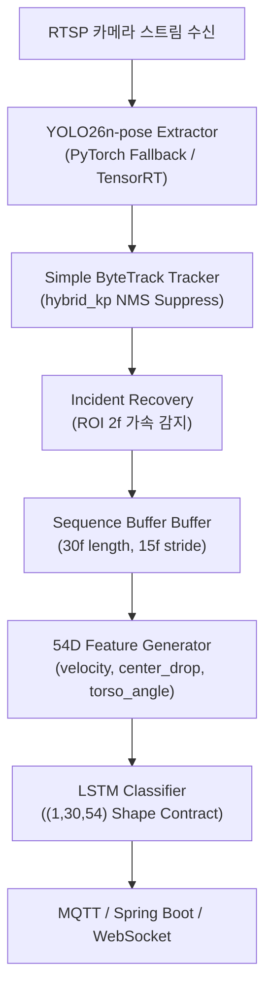

## 1. 문제 정의

스마트 안전 관제 시스템에서 CCTV 실시간 스트림으로부터 사람이 쓰러지는 이상행동(Faint)을 지연 없이 정밀 감지하고, 네트워크 일시 단절 및 관절 검출 노이즈가 유발하는 오경보를 실시간 차단하는 종합 AI 파이프라인 설계가 요구됩니다.

## 2. 실제 관찰 및 원인

- 단일 프레임 수준의 관절 검출기(YOLO Pose) 단독 성능만으로는 서 있음, 앉아 있음, 쓰러짐의 시간적 문맥(Temporal Context)을 변별할 수 없어 오탐 및 미탐이 발생했습니다.
- RTSP 재연결 상황에서 트래커 ID가 Fragmentation 되거나, NMS 중복 박스로 인해 신규 트랙이 오발급되는 현상이 감지되었습니다.
- 무거운 GPU 추론으로 인해 실시간 프레임 레이트(Effective FPS)가 유지되지 못하는 하드웨어 병목이 관찰되었습니다.

## 3. 내가 한 판단

- **다단계 파이프라인 결합**: 단일 프레임 Extractor(YOLO)와 temporal 분류기(LSTM)를 촘촘히 체이닝하는 구조를 구축하였습니다.
- **안정적 추론 및 트래킹 자가 복구**: TensorRT 가속 엔진을 백엔드로 도입하되 안전성을 위해 PyTorch Fallback을 이중화하고, 스트림 격차 감시를 통한 트래커 강제 리셋을 반영하였습니다.
- **모션 특징 벡터 및 중복 억제 확장**: 관절 51차원 공간에 하강 속도/기울기를 포함한 54차원으로 확장하고, 중복 박스를 suppression 하는 트래킹 기법을 표준화하였습니다.

## 4. 구현 및 검증 (E2E 데이터 흐름)

안전 관제 AI 코어 파이프라인의 전체 데이터 흐름도 및 구성 사양입니다.

### 4.1 핵심 구성 요소 및 상세 링크
- **벤치·근거 허브:** 조건별 TensorRT / 54D / MQTT E2E / 2-cam RTSP — [Benchmark-Evidence-Hub](Benchmark-Evidence-Hub.md).
- **Pose Extractor (YOLO26n-pose)**: Faint Recall 및 다운스트림 LSTM 성능 극대화를 위해 선택된 기본 모델입니다. 상세 비교 지표는 **[Model-Comparison](Model-Comparison.md)**을 참고하십시오.
- **TensorRT 가속 런타임**: YOLO 추론 지연을 약 40.8% 단축하여 GPU 마진을 확보하는 런타임 엔진입니다. 자세한 검증 결과와 하드웨어 제약은 **[Evidence-TensorRT-Adoption-Decision](Evidence-TensorRT-Adoption-Decision.md)**을 참고하십시오.
- **안정화된 트래커 및 자가 복구 (Tracking & Incident Recovery)**: ID Fragmentation을 방지하기 위한 NMS suppression(`hybrid_kp`), ROI 가속 복구 및 velocity spike 방어용 discontinuity mask 장치입니다. 상세 벤치마크는 **[Tracking-Association-Stabilization](Tracking-Association-Stabilization.md)**을 참고하십시오.
- **54차원 모션 특징 벡터 (Feature Schema)**: 정적 좌표에 속도/기울기를 결합해 F1-Score를 93.49%로 개선한 특징 규격입니다. 세부 수식과 preflight 통과 지표는 **[Feature-Vector-51D-vs-54D](Feature-Vector-51D-vs-54D.md)**를 참고하십시오.
- **실시간 송출 및 세션 경계 관리 (RTSP/MJPEG Display)**: `cameraLoginId` 기반 동적 포트 매핑, 15 FPS 제한 송출, 그리고 프레임 유실 감지 기반 세션 강제 리셋 규격입니다. 상세 troubleshooting 내역은 **[Realtime-Camera-Runtime-Stabilization](Realtime-Camera-Runtime-Stabilization.md)**을 참고하십시오.

---

## 5. 한계 및 후속 작업

### 한계
- 다단계 파이프라인의 특성상 앞단(YOLO/Tracker)의 누락이 뒷단(LSTM)의 판단 누락으로 이어지는 연쇄 에러 전파(Cascade Error Propagation) 위험이 존재합니다.
- 모션 스파이크 방어가 완벽하지 않아 일시적인 프레임 스킵 상황에서 이상행동 확률 변동이 존재합니다.

### 후속 작업
- **E2E 연계 학습**: Extractor의 confidence 가중치와 LSTM을 end-to-end로 미세조정하는 연계 훈련 파이프라인 설계 (미완료).
- **consecutive-Faint Cooldown 튜닝**: 알림 전송을 제어하기 위해 프론트엔드 및 백엔드 Cooldown 시간 정합성 튜닝.
- **Faint/Exit/Hazard cooldown (develop)**: `ai/action/faint_post_processing.py` — exit·hazard cooldown **60s** on `origin/develop` (`27093423`, 2026-07-15). 로컬이 `vlm-home-draft-hardening`이면 15s일 수 있음 → [Develop-Code-Baseline-2026-07-15](Develop-Code-Baseline-2026-07-15.md).

---
#ai-pipeline #yolo26n #tensorrt #tracking #lstm #architecture
