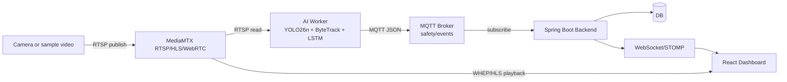

# Architecture

## 목적

Camera → MediaMTX → AI → MQTT → Backend → DB/WebSocket → Frontend 흐름을 한 장의 계약으로 이해하고, 통합 시 가장 자주 깨지는 지점을 미리 파악할 수 있도록 정리한다.

## 배경

프로젝트는 AI, Backend, Frontend, Infra가 nested repository 형태로 분리되어 있다. 연결 실패의 대부분은 카메라 식별자 불일치에서 시작된다. `cameraLoginId`가 RTSP path, MediaMTX 경로, MQTT `streamId`, Backend camera registry, Frontend stream URL에서 서로 다른 값으로 쓰이면 영상은 누락되고 이벤트 매핑도 실패한다. 이 문서는 그 표준을 한 곳에 고정한다.

## 핵심 내용

아키텍처의 기준 식별자는 `cameraLoginId`다. 같은 카메라는 RTSP path, WebRTC/HLS path, MQTT `streamId`, Backend camera registry에서 같은 값으로 연결되어야 한다.



| Layer | Standard |
| --- | --- |
| RTSP publish | `rtsp://<host>:8554/{cameraLoginId}` |
| HLS view | `http://<host>:8888/{cameraLoginId}/index.m3u8` |
| WebRTC WHEP | `http://<host>:8889/{cameraLoginId}/whep` |
| MQTT topic | `safety/events` |
| Camera status topic | `/topic/camera-status` |

## 입력

- 개인 사용자 또는 기관 사용자가 등록한 카메라
- RTSP sample video publish
- AI worker 모델/threshold 설정
- Backend camera registry

## 출력

- DB에 저장된 incident/event
- Frontend 실시간 영상
- WebSocket 알림
- 사용자 scope에 맞는 알림 표시

## 동작 흐름

```text
Camera/RTSP
-> MediaMTX path by cameraLoginId
-> AI Worker reads stream and analyzes frames
-> MQTT safety/events publish
-> Backend stores event and resolves scope
-> DB/WebSocket broadcast
-> Frontend dashboard notification and playback
```

## 관련 파일

- `PROJECT_CONTRACT.md`
- `strange_infra/docker-compose.yml`
- `strange_front/src/features/dashboard/data/cameras.ts`
- `strange_back/src/main/java/com/strange/safety/alert/service/AlertEventService.java`

## 관련 문서

- [Overview](Overview.md)
- [AI-Pipeline](AI-Pipeline.md)
- [MQTT-Event-Schema](MQTT-Event-Schema.md)
- [WebRTC-vs-HLS](WebRTC-vs-HLS.md)

## 주의사항

AI가 관제자를 대체하는 것이 아니라 판단 공백을 줄이는 보조 시스템이다. 따라서 영상 재생, 이벤트 저장, 알림 scope는 모두 사람이 확인 가능한 근거를 남겨야 한다.

## 후속 작업

통합 브랜치에서 RTSP path, MQTT `streamId`, Backend camera id, Frontend stream URL을 한 번에 검증하는 smoke test를 추가한다.
