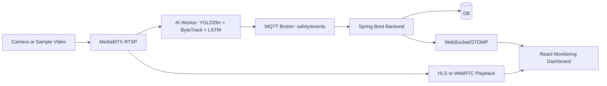

# Architecture

## 목적

전체 시스템의 Camera, MediaMTX, AI, MQTT, Backend, DB/WebSocket, Frontend 흐름을 한 장의 계약으로 이해한다.

## 배경

각 파트가 독립 브랜치와 폴더에서 작업하기 때문에 통신 계약이 흔들리면 통합 시점에 문제가 커진다. 특히 카메라 경로, MQTT payload, WebSocket topic은 모든 파트가 같은 용어로 이해해야 한다.

## 핵심 내용

운영 표준 경로는 `cameraLoginId`를 중심으로 맞춘다.

| Layer | Standard |
| --- | --- |
| RTSP publish | `rtsp://<host>:8554/{cameraLoginId}` |
| HLS view | `http://<host>:8888/{cameraLoginId}/index.m3u8` |
| WebRTC WHEP | `http://<host>:8889/{cameraLoginId}/whep` |
| MQTT topic | `safety/events` |
| Camera status topic | `/topic/camera-status` |

## 입력

- 카메라 스트림 또는 sample video publish
- Backend camera registry
- AI inference configuration

## 출력

- 안전 이벤트 저장
- 관제 화면 알림
- 실시간 스트림 재생

## 동작 흐름

## 관련 파일

- `PROJECT_CONTRACT.md`
- `docs/webrtc_smoke.md`
- `strange_front/src/features/dashboard/components/WebRtcCameraPlayer.tsx`
- `strange_back/src/main/java/com/strange/safety/event`

## 관련 문서

- [Overview](Overview.md)
- [AI-Pipeline](AI-Pipeline.md)
- [WebRTC-vs-HLS](WebRTC-vs-HLS.md)

## 주의사항

`cam1`은 초기 smoke test 임시 경로였고 운영 표준이 아니다. 신규 문서와 코드 예시는 `cam_01` 또는 실제 `cameraLoginId` 형식을 사용한다.

## 후속 작업

통합 브랜치에서 API, MQTT, WebSocket topic의 실제 구현과 이 문서를 주기적으로 대조한다.
