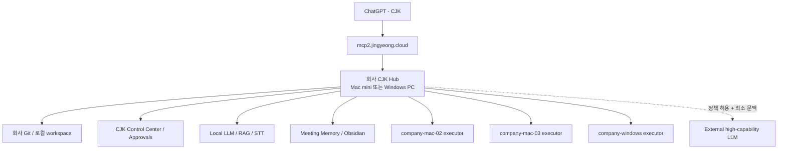
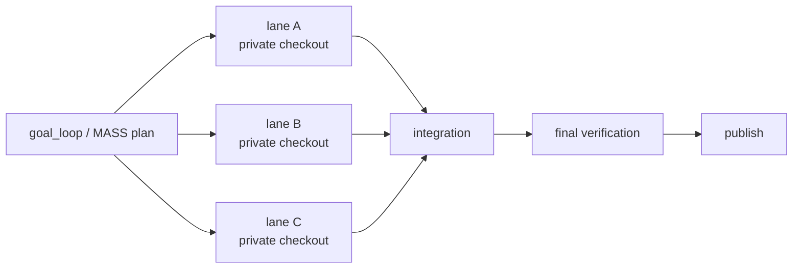
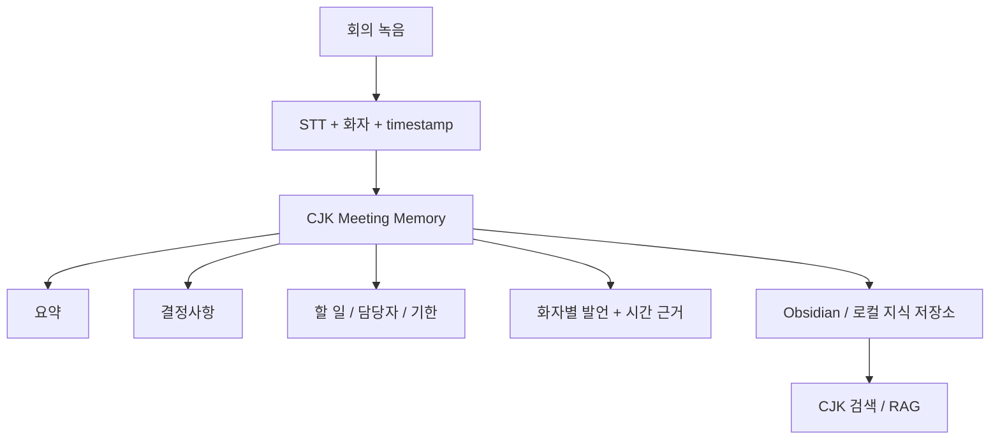
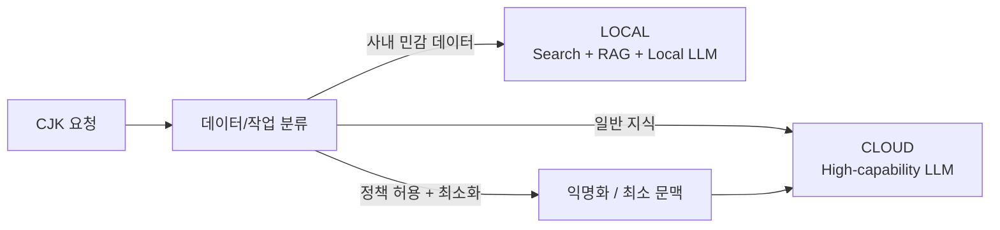

## 한 줄 요약

**개인용 JK는 기존 OCI 하이브리드를 유지하고, 회사용 CJK는 회사 장비 안에 별도 MCP·상태·권한 경계를 만든다.** 회사 데이터는 기본적으로 로컬에서 처리하고, 일반 지식이나 높은 추론 성능이 꼭 필요한 작업만 회사 정책이 허용하는 범위에서 외부 LLM으로 보낸다.

## 왜 JK와 CJK를 나누는가

개인 환경과 회사 환경을 같은 MCP, executor ID, state, Git credential로 사용하면 편해 보이지만 장기적으로는 위험하다. 회사 프로젝트와 개인 프로젝트가 섞일 수 있고, 같은 executor ID의 토큰을 다시 발급했을 때 기존 토큰이 무효화되는 식의 운영 충돌도 생길 수 있다.

따라서 소스 코어는 최대한 공유하되 **런타임 프로필과 데이터 경계는 분리**한다.

| 구분 | 개인 JK | 회사 CJK |
| --- | --- | --- |
| ChatGPT 연결 | `JK` | `CJK` |
| MCP 도메인 | `mcp.jingyeong.cloud` | `mcp2.jingyeong.cloud` |
| 제어 plane | OCI JK | 회사 메인 장비 |
| state | JK 전용 | CJK 전용 |
| executor 예시 | `windows-main` | `company-mac-01`, `company-windows` |
| Git/SSH | 개인 계정 | 회사 계정 |
| 데이터 범위 | 개인 프로젝트 | 회사 프로젝트 |

핵심은 `JK.exe`와 `CJK.exe`를 서로 다른 코드베이스로 포크하는 것이 아니다. **하나의 JK 코어가 `personal` / `company` 프로필을 받아 서로 다른 hub, state, executor, credential을 사용하도록 만드는 방향**이 유지보수에 유리하다.

## 목표 구조



회사에서 Mac mini를 여러 대 사용한다면 **한 대를 CJK Hub로 정하고 나머지는 필요할 때 executor로 붙이는 구조**가 가장 단순하다. 회사 장비가 Windows라면 같은 CJK 프로필을 Windows 런처에 적용하면 된다.

## Mac mini는 어떤 역할인가

Mac mini는 모니터가 붙어 있지 않은 작은 서버 전용 장비가 아니라, **macOS가 돌아가는 애플 데스크톱 본체**다. 최신 Apple Silicon 기반 Mac mini라면 CJK를 macOS 네이티브로 운영하는 것이 기본 방향이다.

회사 장비가 아직 Mac인지 Windows인지 확실하지 않으므로 CJK 코어는 OS 공용으로 두고 진입점만 다르게 준비한다.

```text
Windows
  CJK profile이 적용된 JK launcher / app

macOS
  CJK launcher + launchd

공통
  CJK core
  Git / workspace / approvals / MCP / executor protocol
```

## macOS 지원 현재 상태

JK의 executor 핵심은 이미 대부분 플랫폼 중립적이다. 프로젝트 탐색, Git, 파일 검색·읽기·수정, 테스트, local shell, 스크린샷, executor heartbeat 같은 기능은 macOS에서도 같은 코어를 사용할 수 있다.

회사 Mac mini를 위한 첫 부트스트랩도 별도 경로로 준비했다.

- `macos/install-cjk-hub.sh`
  - 메인 Mac mini를 CJK MCP/Control Plane으로 구성
  - 기본 포트 `7980`
  - `launchd` 자동 시작
- `macos/install-cjk-executor.sh`
  - 추가 Mac mini를 `company-mac-*` executor로 등록
  - `launchd` 자동 시작
  - executor token은 plist가 아니라 별도 파일에 저장하고 권한을 제한
- macOS bootstrap 테스트 추가

OCI/Linux에서 가능한 검증은 통과했다.

```text
bash syntax               PASS
macOS bootstrap tests     3 / 3 PASS
TypeScript typecheck      PASS
full regression           661 PASS / 6 SKIP
build                     PASS
```

아직 실제 Mac에서 다음 항목은 확인해야 한다.

```text
LOCAL_VERIFICATION_PENDING
- launchctl 등록/재부팅 자동 시작
- http://127.0.0.1:7980/healthz
- 두 번째 Mac executor heartbeat
- macOS 화면 기록 / 손쉬운 사용 등 권한
```

즉 **Windows판을 Mac용으로 다시 만드는 작업은 아니다.** 이미 공용인 코어 위에 macOS 설치·자동시작·권한 UX를 다듬는 작업에 가깝다.

## 회사 첫날 부트스트랩 목표

사용자가 macOS 명령어를 미리 외우는 구조를 목표로 하지 않는다. 가장 이상적인 흐름은 다음과 같다.

```text
1. CJK 런처 설치/실행
2. ChatGPT에 CJK MCP 연결
3. 필요한 OS 권한만 허용
4. 이후 CJK가 자신의 실행 환경을 검사
5. workspace / Git / SSH / 자동시작 / executor를 CJK를 통해 설정
```

초기 연결만 성공하면 이후에는 CJK에게 다음처럼 요청할 수 있어야 한다.

```text
"이 맥 개발환경 상태 확인해줘"
"회사 Git 연결해줘"
"workspace 정리해줘"
"다른 Mac mini를 executor로 붙여줘"
"재부팅 후 CJK 자동으로 살아나는지 검증해줘"
```

### 첫 장비 세팅 체크리스트

- 회사 전용 macOS/Windows 사용자 계정
- 회사 Git 계정과 SSH key
- `~/workspace` 같은 고정 workspace
- Node.js, Git, Python, Docker, `ripgrep`, `jq`, `gh` 등 기본 도구
- CJK state와 secret을 프로젝트 소스와 분리
- 허브 장비 절전 정책 조정
- SSH/화면 공유 등 장애 복구 수단
- 소스는 가능하면 로컬 SSD + Git에 두고 NAS/공유 드라이브는 문서·데이터 중심으로 사용
- 회사 정책이 허용하면 `mcp2.jingyeong.cloud` → CJK Hub로 HTTPS/Tunnel 구성

## MASS ULW on Mac

### 현재 가능한 것

메인 Mac mini의 **로컬 Git checkout**을 기준으로 MASS ULW를 실행하는 것은 기존 구조를 그대로 사용할 수 있다. MASS ULW는 각 lane을 private checkout에 격리하고 최종적으로 통합·검증한다.



### 현재 제한

현재 MASS ULW는 **remote executor에 라우팅된 프로젝트를 직접 fan-out 대상으로 쓰지 않는다.** private lane workspace를 원격 executor bridge 너머에 안전하게 만들 수 없도록 명시적으로 차단되어 있다.

따라서 현재는 다음 구조다.

```text
Mac mini #1
  lane A
  lane B
  lane C
  merge
  final verification
```

아직 다음처럼 Mac 여러 대에 lane 하나씩 자동 배분하지는 않는다.

```text
Mac #1 -> lane A
Mac #2 -> lane B
Mac #3 -> lane C
```

### 후속 로드맵: Distributed MASS ULW

회사에 Mac mini가 10대 이상 있고 실제로 자동화 노드로 사용할 수 있다면 **Distributed MASS ULW**를 후속 기능으로 검토할 가치가 있다.

원칙은 장비가 많다고 무조건 전부 쓰는 것이 아니다.

- 작은 수정: 1대
- 독립적인 구현 3개: 3대
- 빌드·QA를 분리할 가치가 있을 때: 추가 노드 사용
- 같은 파일/같은 자원을 수정하는 lane: 순차 처리
- 최종 merge와 회귀 검증: Hub가 책임

즉 하드웨어 수보다 **의존성, write scope 충돌, 검증 비용을 보고 필요한 만큼만 fan-out**하는 스케줄러가 필요하다.

## Meeting Memory: 회의를 회사 기억으로 만들기

CJK의 첫 실사용 자동화 후보는 단순 회의 요약기가 아니라 **“언제 누가 무슨 말을 했고, 그 말이 어떤 결정과 구현으로 이어졌는지 추적하는 시스템”**이다.



입력은 회사 정책에 따라 선택한다.

- PLAUD 같은 녹음 도구의 export/연동을 허용하는 경우 해당 transcript 사용
- 외부 녹음 서비스가 허용되지 않으면 로컬 녹음 → Mac mini 로컬 STT
- 이미 존재하는 회의록/메신저 로그를 import

Obsidian을 저장·열람 UI로 쓴다면 예시는 다음과 같다.

```text
meetings/
  2026-09-03_주간개발회의.md
  2026-09-05_AI자동화회의.md

people/
  김OO.md
  박OO.md

projects/
  ERP.md
  내부자동화.md
```

CJK는 `사람 ↔ 회의 ↔ 프로젝트 ↔ 결정 ↔ 코드 변경`을 연결한다.

예를 들어 몇 달 뒤 다음 질문에 근거와 함께 답하는 것이 목표다.

```text
Q. 왜 이 로그인 구조로 구현했지?

A. 9월 7일 개발회의에서 기존 사내 SSO 유지로 결정됨.
   - 김OO 발언: 14:32
   - 결정사항: 신규 로그인 시스템 개발하지 않음
   - 이후 관련 Git 변경: ...
```

핵심은 예쁜 요약보다 **원문 회의, 화자, timestamp를 잃지 않는 것**이다.

> 회의 녹음과 전사는 회사 보안 정책, 개인정보 처리 기준, 참석자 동의를 먼저 따른다.

## Local-first AI Gateway

회사에서 로컬 LLM을 쓸 가능성이 있다면 CJK를 단순 실행 도구보다 **AI Gateway**로 보는 편이 좋다.

문제는 두 가지다.

1. 로컬 LLM은 최신 대형 클라우드 모델보다 복잡한 추론 성능이 낮을 수 있다.
2. 그렇다고 회사 원문, 코드, 고객 정보, 회의 전체를 무조건 외부 서비스에 전송할 수는 없다.

해결 방향은 한 모델에 모든 일을 맡기는 것이 아니라 **데이터 민감도와 작업 난이도에 따라 라우팅**하는 것이다.



### 기본 라우팅 예시

| 요청 | 기본 경로 |
| --- | --- |
| "어제 회의에서 김OO가 뭐라고 했지?" | 로컬 검색 + 로컬 LLM |
| 고객 정보가 포함된 문서 요약 | 로컬 |
| 회사 핵심 소스 전체 분석 | 로컬 우선 |
| 민감 코드 버그 분석 | 로컬, 정책 허용 시 최소 snippet만 외부 |
| "OAuth와 JWT 차이 알려줘" | 외부 고성능 LLM 사용 가능 |
| 일반 알고리즘 설계 아이디어 | 회사 정보가 없으면 외부 사용 가능 |

외부 모델을 쓰는 경우에도 **원문 전체를 보내는 것이 기본값이면 안 된다.** 정책이 허용한 작업에서 필요한 정보만 최소화·익명화하여 전달하는 방향이 안전하다.

## 로컬 LLM이 덜 똑똑해도 쓸 수 있는 이유

회의 검색 같은 작업은 LLM이 모든 회의를 기억하고 추론할 필요가 없다. 검색/RAG 계층이 정확한 원문을 먼저 찾아주면 로컬 LLM은 **찾아온 근거를 짧게 정리하는 역할**만 맡아도 된다.

```text
회의 음성
-> 로컬 STT
-> 화자/시간 transcript 저장
-> embedding / keyword index
-> 관련 원문 5~20개 검색
-> Local LLM이 근거 안에서 요약
```

따라서 로컬 모델 경쟁력은 단순한 벤치마크 점수만으로 판단하지 않는다. **검색 정확도, 근거 보존, 사내 데이터 경계, 응답 속도**를 함께 본다.

## Mac mini가 여러 대일 때의 확장 예시

처음부터 모든 Mac을 역할별로 쪼갤 필요는 없다. 한 대에서 먼저 완성한 뒤 병목이 확인될 때 분리한다.

```text
Mac mini #1  CJK Hub + MCP + DB
Mac mini #2  STT / 회의 전사
Mac mini #3  Local LLM inference
Mac mini #4  Embedding / RAG index
Mac mini #5  Build / test executor
Mac mini #6+ 필요 시 프로젝트 executor / QA
```

이 구조의 장점은 모델 한 대를 크게 만드는 것이 아니라 **사내에 이미 존재하는 장비를 작업 종류에 따라 활용할 수 있다는 점**이다.

## 단계별 도입안

### Phase 1 — 장비 독립 CJK

- 개인 JK / 회사 CJK 프로필 분리
- `mcp2.jingyeong.cloud` 연결
- Windows와 macOS 공용 코어 유지
- 메인 회사 장비 한 대에서 CJK 실행
- 회사 Git/workspace/state 격리

### Phase 2 — Mac 실기 검증과 운영화

- 실제 Mac mini에서 launchd 검증
- 재부팅 복구
- macOS 권한 UX
- 추가 Mac executor 등록
- CJK Control Center에서 Mac pairing 단순화

### Phase 3 — Meeting Memory

- 로컬 또는 승인된 회의 입력
- 화자/timestamp transcript
- 결정·할 일 자동 추출
- Obsidian/로컬 DB 저장
- 회의 ↔ 사람 ↔ 프로젝트 ↔ Git timeline 연결

### Phase 4 — Local-first AI Gateway

- 데이터 등급/민감도 라우터
- 로컬 STT, RAG, Local LLM
- 외부 모델 사용 정책
- 최소 문맥/익명화 계층
- 요청별 감사 로그

### Phase 5 — Distributed MASS ULW

- 여러 Mac executor에 독립 lane 배분
- write-scope 충돌 방지
- 원격 private checkout 수명주기
- Hub 통합/최종 검증
- 장비 상태와 작업비용 기반 scheduler

## 현재 결론

지금 당장 완성해야 할 것은 거대한 사내 AI 플랫폼이 아니다.

**CJK 한 대가 안정적으로 회사 장비에 붙고, 회사 코드를 안전하게 읽고 수정하고 테스트할 수 있는 상태가 먼저다.** 그 위에 회의 기억과 로컬 LLM 라우터를 추가하면 CJK는 단순한 `회사판 JK`가 아니라 다음 역할을 갖게 된다.

```text
CJK
├─ 회사 개발 작업 허브
├─ Git / 코드 / 테스트 executor
├─ 회의와 결정의 기억 시스템
├─ 사내 문서 검색/RAG
├─ 로컬 LLM gateway
├─ 승인된 외부 AI gateway
└─ 향후 multi-Mac MASS ULW scheduler
```

최종 목표는 **사내 데이터는 필요 이상으로 밖으로 보내지 않으면서, 로컬 모델의 한계 때문에 개발 생산성을 포기하지 않는 하이브리드 AI 개발 환경**이다.
