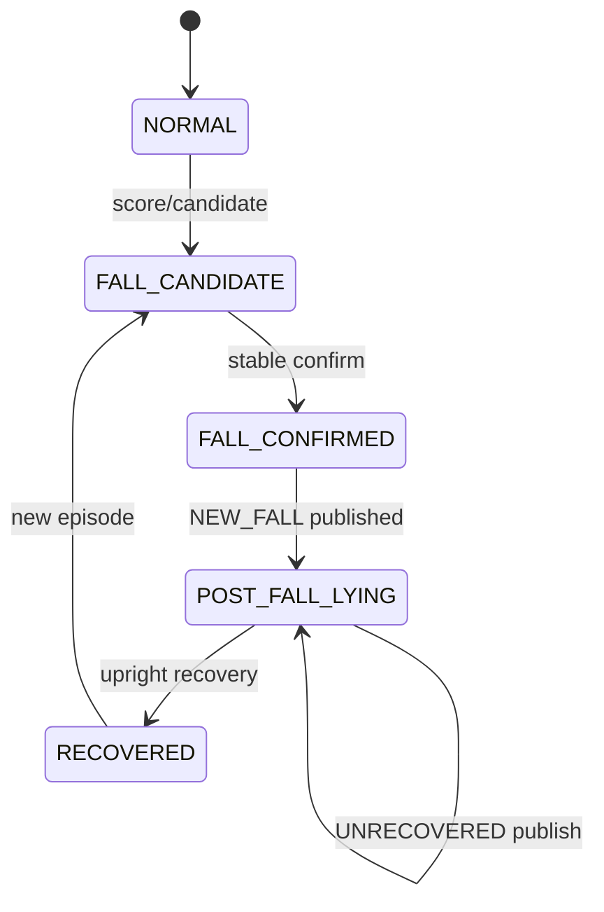
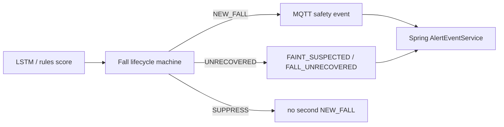

# Fall·Faint Lifecycle: 단일 threshold를 버린 이유

## 1. 문제 정의

실신·낙상 관제에서 운영자가 원하는 알림은 “이 프레임 confidence 0.87”이 아니다.

- **처음 넘어진 순간** (신규 Fall)
- **넘어진 채 회복하지 못하는 지속 위험** (미회복 / 실신 의심)
- **일어선 회복**

단일 프레임 분류 점수나 단순 cooldown만 쓰면, 누운 자세가 유지되는 동안 **같은 낙상 알림이 반복**되거나, 반대로 지속 위험을 **두 번째 Fall로 오인**한다.  
나는 이를 분류 모델 문제만이 아니라 **이벤트 lifecycle 상태머신 부재**로 정의했다.

## 2. 기존 구조의 한계

규칙 기반 `FallRuleEngine` (`ai/rules/fall_rule.py`)은 다음을 가진다.

- `candidate_threshold`, `min_duration_seconds`, `debounce_seconds`
- 최근 윈도우 내 candidate 투표 (`decision_window` / `decision_required`)
- track별 NORMAL → CANDIDATE → CONFIRMED

한계:

1. debounce는 “시간 간격”만 막을 뿐, **POST_FALL 동안 NEW_FALL 재발행 금지**를 상태 불변조건으로 강제하지 않는다.
2. 지속 누움과 신규 낙상을 같은 `type`으로 내면 Backend·Front 알림 UX가 구분되지 않는다.
3. LSTM 경로가 추가되면서 “한 번 확정된 낙상 이후”의 정책이 문서·코드 양쪽에 더 명시적으로 필요해졌다.

## 3. 내가 확인한 근거

### 코드에서 확인된 사실

`ai/ai/action/fall_event_state.py` 모듈 독스트링과 타입:

- `FallState`: NORMAL, FALL_CANDIDATE, FALL_CONFIRMED, POST_FALL_LYING, RECOVERED
- `LifecycleKind`: NEW_FALL, SUPPRESS_NEW_FALL, UNRECOVERED, …
- `LifecycleDecision.should_publish`: NEW_FALL 또는 UNRECOVERED만 publish 허용
- `allow_new_fall_alert` / `allow_unrecovered_alert` 분리
- 정책 주석:
  - NEW_FALL은 첫 confirm에만
  - POST_FALL_LYING 중 재-NEW_FALL 금지 (cooldown만으로 부족)
  - `unrecovered_after_seconds` 후에도 위험 자세면 UNRECOVERED
- `unrecovered_event_type_for_prediction`: movement still/low → `FAINT_SUSPECTED`, 그 외 → `FALL_UNRECOVERED`
- public 상수: `EVENT_TYPE_FAINT_SUSPECTED`, `EVENT_TYPE_FALL_UNRECOVERED`

관련 후처리: `faint_post_processing.py`, 설정: `fall_lifecycle_config.py`.  
계약 문서: `FALL_EVENT_LIFECYCLE_MQTT_CONTRACT.md`, handoff 문서.

### 문서에서 확인된 판단

- Unrecovered 이벤트는 두 번째 Fall이 아니라 **지속 위험 신호**로 취급해야 한다는 handoff 설명.

### 추가 확인이 필요한 부분

- 현장 데이터에서 `unrecovered_after_seconds` 최적값.
- Backend UI가 모든 lifecycle phase를 완전히 구분 표시하는지(버전별 편차 가능).

## 4. 내가 한 판단

나는 **단일 confidence threshold 알람**을 버리고, track별 상태머신 + publish kind 분리를 선택했다.

| 선택지 | 결론 |
| --- | --- |
| 매 프레임 score > T → MQTT | 스팸·중복 → 기각 |
| score + 고정 cooldown만 | 누움 유지 시 정책 모호 → 불충분 |
| **Lifecycle state machine + NEW_FALL/UNRECOVERED 분리** | 채택 |
| 완전 수동 운영자 확인만 | 실시간 관제 SLA 불가 |

판단의 핵심 문장:

> cooldown은 보조 게이트일 뿐이고, “아직 누워 있는 동일 트랙”에서는 NEW_FALL을 상태 불변조건으로 막아야 한다.

## 5. 주요 구현과 핵심 함수

### `LifecycleDecision` — `fall_event_state.py`

- 출력: kind, state, event_id, original_event_id, duration, event_type override.
- `should_publish`로 발행 여부를 한곳에서 결정.

### `unrecovered_event_type_for_prediction`

- 입력: prediction dict, movement_level, posture_label.
- 출력: `FAINT_SUSPECTED` 또는 `FALL_UNRECOVERED`.
- 이유: 움직임이 거의 없으면 실신 의심 쪽 라벨이 운영 언어에 가깝다.

### `FallRuleEngine.evaluate` — `fall_rule.py` (보조/레거시 규칙 경로)

- 연속 candidate + min duration + debounce.
- lifecycle 머신과 역할이 겹칠 수 있으나, **확정 후 장기 상태**는 state machine 쪽이 권위 있음.

### 테스트

- `test_fall_event_state_machine.py`
- `test_unrecovered_event_payload.py`
- `test_fall_rule.py`

## 6. 전체 데이터 흐름

## 7. 그로 인한 결과

- 동일 누움 구간에서 **Fall 알림 폭주**를 상태 불변조건으로 억제할 수 있다.
- 지속 위험은 **별도 이벤트 타입**으로 남길 수 있다.
- MQTT·Backend·Front handoff 문서와 타입이 맞춰지기 시작한다.
- 단위 테스트로 “재-NEW_FALL 금지 / unrecovered payload”를 회귀 가능하게 했다.

## 8. 검증 방법

| 검증 | 상태 |
| --- | --- |
| state machine 단위 테스트 | 코드 존재 |
| unrecovered payload 테스트 | 코드 존재 |
| 실영상 장시간 누움 시나리오 E2E | 추가 확인 필요 (GPU/현장) |

## 9. 한계와 후속 계획

- 자세·움직임 추정 오류가 있으면 FAINT_SUSPECTED vs FALL_UNRECOVERED 선택이 흔들린다.
- track ID switch(사람이 바뀌는데 ID 유지/교체) 시 lifecycle이 꼬일 수 있어 **세션·tracker 품질**에 의존한다.
- Backend 알림 문구/우선순위 매핑은 이벤트 타입 추가에 맞춰 지속 점검이 필요하다.

## 근거 수준 요약

| 주장 | 수준 |
| --- | --- |
| NEW_FALL / UNRECOVERED 분리 정책 | 코드에서 확인된 사실 |
| cooldown만으로는 부족하다는 모듈 주석 | 코드에서 확인된 사실 |
| 운영 오탐률 X% 개선 | 작성하지 않음 |
