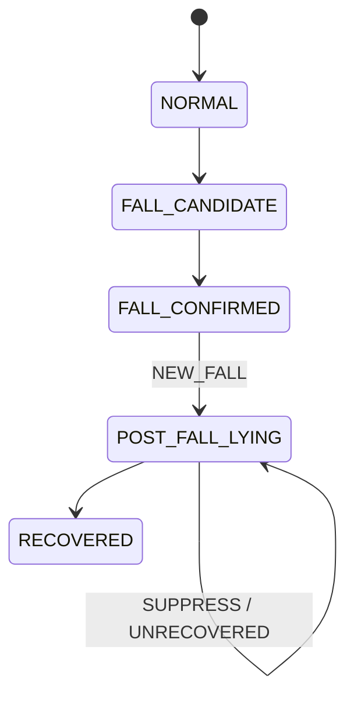

> **한 줄 결론**
>
> 단일 confidence threshold 대신 track별 **lifecycle 상태 머신**을 두어,  
> **POST_FALL에서는 NEW_FALL을 다시 발행하지 않는 불변조건**과 지속 위험(`UNRECOVERED`)을 분리했다.

| 항목 | 내용 |
| --- | --- |
| 문제 | 누운 자세 유지 중 Fall 알림 폭주 / 지속 위험 미구분 |
| 판단 | NEW_FALL vs UNRECOVERED 분리 |
| 핵심 코드 | `FallState`, `LifecycleKind`, `LifecycleDecision` |
| 결과 | 재-NEW_FALL 억제, FAINT_SUSPECTED / FALL_UNRECOVERED |
| 검증 | state machine·unrecovered payload 테스트 |

## 문제 정의

운영자가 원하는 것은 프레임 점수가 아니라 **처음 넘어진 순간**, **미회복 지속 위험**, **회복**이다.

단일 점수나 단순 cooldown만 쓰면 같은 낙상이 반복되거나, 지속 위험이 두 번째 Fall로 오인된다.

## 기존 구조의 한계

`FallRuleEngine`은 candidate 윈도우·debounce를 갖지만, POST_FALL 중 NEW_FALL 금지를 **상태 불변조건**으로 강제하지 않는다.

## 내가 확인한 근거

### 코드에서 확인된 사실

- `FallState`: NORMAL → … → POST_FALL_LYING → RECOVERED
- `LifecycleKind`: NEW_FALL, SUPPRESS_NEW_FALL, UNRECOVERED
- `should_publish`: NEW_FALL 또는 UNRECOVERED만
- movement still/low → `FAINT_SUSPECTED`, 그 외 → `FALL_UNRECOVERED`

## 내가 한 판단

나는 단순 cooldown이 아니라 **POST_FALL 상태에서는 NEW_FALL을 다시 발행하지 않는 불변조건**이 필요하다고 판단했다.

## 주요 구현과 핵심 함수

- `LifecycleDecision` — publish 여부 일원화
- `unrecovered_event_type_for_prediction`
- `FallRuleEngine.evaluate` — 보조 규칙 경로

## 데이터 흐름

## 그로 인한 결과

동일 누움 구간 Fall 폭주 억제, 지속 위험 타입 분리, 회귀 테스트 가능.

## 검증

| 검증 | 상태 |
| --- | --- |
| state machine / unrecovered 테스트 | 코드 존재 |
| 실영상 장시간 누움 E2E | 추가 확인 필요 |

## 한계와 후속 계획

움직임 추정 오류와 track switch가 lifecycle을 흔들 수 있다. tracker·세션 품질에 의존한다.
