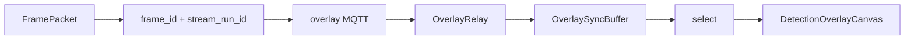

> **한 줄 결론**
>
> 영상과 AI Overlay를 맞추기 위해 **timestamp 보조 + frameId 우선** 매칭을 택하고,  
> 스트림 재시작 충돌은 `streamRunId`를 넣은 **evidence 키**로 막았다.

| 항목 | 내용 |
| --- | --- |
| 문제 | Overlay가 다른 프레임에 그려지는 신뢰 붕괴 |
| 판단 | frameId 우선, streamRunId로 유일성 |
| 핵심 코드 | `evidence_frame_key`, `OverlaySyncBuffer.select` |
| 결과 | delay 보정 선택 + warning 플래그 |
| 검증 | verify-overlay-sync-*.mjs, AI frame_sync 테스트 |

## 문제 정의

영상 플레이어와 AI bbox가 **서로 다른 시각의 장면**이면 운영 신뢰가 무너진다.  
문제는 미표기보다 **그럴듯한 오정렬**이 더 위험하다.

## 기존 구조의 한계

- 시각만으로 맞추면 클럭·버퍼·인코딩 지연이 겹친다.
- frameId만 쓰면 소스 전환 후 번호 재시작으로 충돌한다.
- “가장 최근 수신 overlay”를 그리면 지연된 영상에 최신 결과가 붙을 수 있다.

## 내가 확인한 근거

### 코드에서 확인된 사실

- `FramePacket`: `frame_id`, `captured_at_ms`, `stream_run_id`, `session_generation`
- `SessionIdentity.evidence_frame_key`: `camera:streamRunId:frameId`
- `evidence_id`: stream_run_id 포함 시 충돌 방지 포맷
- `OverlaySyncBuffer.select`: `nearestByFrameId` 우선, 없으면 delay 보정 시각 nearest
- env: `VITE_FRONT_OVERLAY_DELAY_MS` 등

### 합리적 추론

Backend overlay 중계는 AI 동기 필드를 보존할수록 FE 매칭이 안정적이다.

## 내가 한 판단

| 선택지 | 결론 |
| --- | --- |
| 순수 timestamp | 주 경로 기각 |
| frameId only | streamRunId 결합 필요 |
| **frameId 우선 + timestamp fallback** | **채택** |

## 주요 구현과 핵심 함수

- `evidence_frame_key` / `evidence_id`
- `OverlaySyncBuffer.push` / `select` — `overlaySync.ts`
- `useAiEvents` — buffer push, stale prune

## 데이터 흐름

## 그로 인한 결과

추적 가능한 frame identity, delay 보정 선택, threshold 초과 warning으로 오정렬 관측 가능.

## 검증

| 검증 | 상태 |
| --- | --- |
| AI/FE overlay sync 스크립트 | 코드 존재 |
| 실 스트림 frame-perfect 수치 | 추가 확인 필요 |

## 한계와 후속 계획

플레이어가 frameId를 안 주면 timestamp fallback에 의존한다. DataChannel 동봉은 장기 옵션이다.
