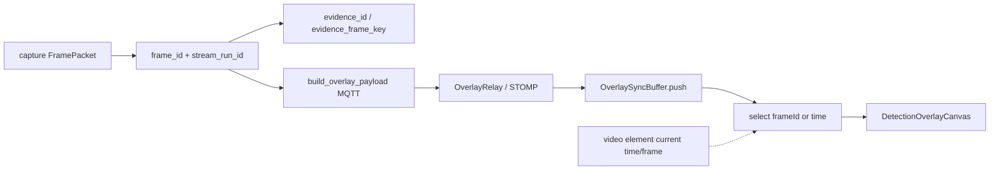

# frameId 증거 체인과 Overlay 동기화 판단

## 1. 문제 정의

영상 플레이어가 보여주는 프레임과 AI가 그린 bbox·skeleton·alert 하이라이트가 **서로 다른 시각의 장면**이면, 운영자는 시스템을 신뢰하지 못한다.  
문제는 “overlay가 안 그려진다”보다 위험하다. **그럴듯하게 잘못된 위치에 그려지는 것**이기 때문이다.

나는 이 문제를 네트워크 지연만의 이슈가 아니라, **프레임 단위 identity가 파이프라인 전 구간에 없는 설계 문제**로 봤다.

## 2. 기존 구조의 한계

- 시각(timestamp)만으로 맞추면 클럭 드리프트·버퍼링·인코딩 지연이 겹쳐 오차가 커진다.
- `frameId`만 쓰면 소스 전환 후 ID가 0부터 다시 시작할 때 **다른 장면의 같은 번호**와 충돌한다.
- AI·Backend·Frontend가 제각기 “최근에 받은 overlay”를 그리면, 스트림 지연과 무관하게 **가장 최신 AI 결과**가 과거 영상에 붙을 수 있다.

## 3. 내가 확인한 근거

### 코드에서 확인된 사실

**AI 측 identity**

- `FramePacket` (`ai/ai/frame_sync.py`): `frame_id`, `captured_at_ms`, `stream_run_id`, `session_generation`.
- `SessionIdentity.evidence_frame_key` (`ai/ai/worker_session.py`):  
  `f"{camera_login_id}:{stream_run_id}:{frame_id}"` — frameId 재시작에도 충돌 방지.
- `evidence_id` (`ai/ai/evidence.py`): `stream_run_id`가 있으면  
  `{cam}-{stream_run_id}-{frameId}-{timestamp_ms}` 형태. 없으면 레거시 `{cam}-{frameId}-{ts}`.
- `latency_order_valid`: `captured ≤ processed ≤ published` 순서 검사.

**Frontend 측 매칭**

- `OverlaySyncBuffer` (`front/src/shared/utils/overlaySync.ts`):
  - 카메라 키별 버퍼, `maxBufferAgeMs` / `maxBufferSize`로 가지치기.
  - `select`: 가능하면 `nearestByFrameId`, 없으면 `now - overlayDelayMs` 시각 nearest.
  - `matchThresholdMs` 초과 시 `warning: true`.
- 기본값: `overlayDelayMs=300`, `maxBufferAgeMs=5000`, `maxBufferSize=300`, `matchThresholdMs=200`.
- env: `VITE_FRONT_OVERLAY_DELAY_MS` 등.
- `useAiEvents.ts`: overlay 수신 시 buffer push, stale window로 오래된 이벤트 prune, 디버그 로그에 `frameId` 기록.

### 문서에서 확인된 판단

- Frame matching / overlay debug 보고서, backend-frontend handoff 문서가 frame 동기 필드를 전제로 한다.
- Multi-cam session 문서는 generation/streamRunId와 증거 키를 운영 경계로 기술한다.

### 합리적 추론

- Backend `OverlayRelayService`가 MQTT overlay를 STOMP로 중계하는 경로는 “AI payload 필드를 가능한 한 보존해 전달”하는 쪽이 동기화에 유리하다. (필드 소실은 FE 매칭 실패로 이어짐)

## 4. 내가 한 판단

나는 **최종 매칭 키를 frameId 우선, timestamp 보조**로 두었다.

| 선택지 | 판단 |
| --- | --- |
| 순수 timestamp 정렬 | 구현 쉽지만 오차 큼 → 기각(주 경로) |
| frameId only | 소스 재시작 충돌 → streamRunId와 결합 필요 |
| **frameId 우선 + delay 보정 timestamp fallback** | FE `OverlaySyncBuffer.select`가 구현한 절충 → **채택** |
| WebRTC DataChannel 프레임 동봉 | 계획/ADR 존재, 전면 전환은 점진적 |

또한 evidence 키에 `stream_run_id`를 넣는 쪽을 선택했다. frameId 재사용을 “버그”가 아니라 **세션 경계 이후 정상 동작**으로 인정하고, 전역 유일성은 복합 키로 보장한다.

## 5. 주요 구현과 핵심 함수

### `SessionIdentity.evidence_frame_key` — `worker_session.py`

- 문제: 카메라·스트림 재시작 간 frameId 충돌.
- 출력: 문자열 키.
- 설계 이유: S3/로그/VLM 상관관계에 재사용 가능한 stable id.

### `evidence_id` — `evidence.py`

- 입력: camera, frameId, timestamp_ms, optional stream_run_id.
- 출력: 하이픈 결합 문자열.
- 레거시 호환: stream_run_id 생략 경로 유지.

### `OverlaySyncBuffer.push` / `select` — `overlaySync.ts`

- 입력: overlay payload + `receivedAtMs`.
- 처리: 버퍼 적재 → delay 보정 target → frameId 또는 시간 nearest.
- 출력: selected event + `overlayTimestampDeltaMs` + warning.
- 호출: `useAiEvents` 구독 경로.

### 검증 스크립트

- `front/scripts/verify-overlay-sync-contract.mjs`
- `front/scripts/verify-overlay-sync-behavior.mjs`

## 6. 전체 데이터 흐름

## 7. 그로 인한 결과

- Overlay 이벤트에 **추적 가능한 frame identity**가 실릴 수 있다.
- FE가 “최신 수신 overlay”가 아니라 **지연 보정된 시점/프레임**을 고른다.
- threshold 초과 시 warning 플래그로 **조용한 오정렬을 관측 가능**하게 했다.
- stream 재시작 후에도 evidence 키가 충돌하지 않도록 계약이 코드에 고정되었다.

## 8. 검증 방법

| 검증 | 상태 |
| --- | --- |
| AI frame_sync / mqtt payload 테스트 | 코드 존재 |
| Front verify-overlay-sync-*.mjs | 코드 존재, CI/로컬 스크립트 |
| 실 스트림에서 frame-perfect 정렬 수치 | 추가 확인 필요 |
| WebRTC DataChannel 동봉 전면 적용 | 부분/계획 |

## 9. 한계와 후속 계획

- MJPEG/WebRTC 플레이어가 **정확한 frameId를 노출하지 않으면** FE는 timestamp fallback에 의존한다.
- `overlayDelayMs=300`은 환경 변수로 조정 가능하지만, 카메라별 최적값은 운영 튜닝 대상이다.
- DataChannel로 영상 프레임과 메타를 묶는 방안(`Plan-WebRTC-DataChannel-Sync`)은 장기적으로 오차를 더 줄일 수 있으나, 현재 주 경로는 MQTT overlay + 버퍼 매칭이다.

## 근거 수준 요약

| 주장 | 수준 |
| --- | --- |
| evidence_frame_key / evidence_id 포맷 | 코드에서 확인된 사실 |
| OverlaySyncBuffer frameId 우선 선택 | 코드에서 확인된 사실 |
| frameId가 timestamp보다 신뢰 | 구조를 바탕으로 한 합리적 추론 + 구현 선택 |
| 모든 배포 환경에서 픽셀 단위 동기 | 추가 확인 필요 |
