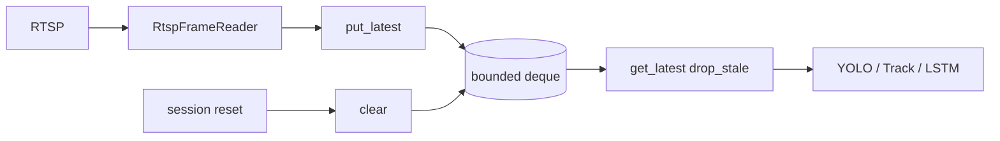

> **한 줄 결론**
>
> 오래된 RTSP 프레임을 모두 처리하지 않고 **최신 프레임만 유지**하여,  
> 분석 완전성보다 먼저 무너질 수 있는 **실시간성**을 보호했다.

| 항목 | 내용 |
| --- | --- |
| 문제 | RTSP 수신이 추론보다 빠를 때 지연 누적 |
| 판단 | Latest-frame + bounded queue |
| 핵심 코드 | `CameraFrameQueue.put_latest`, `get_latest` |
| 결과 | 백로그 drop 관측 가능, 세션 reset 시 `clear` |
| 검증 | `test_frame_queue.py`, `test_frame_sync.py` |

## 문제 정의

관제 화면에서 중요한 것은 과거 프레임의 완전한 재생이 아니라, **지금 카메라 앞에서 일어나는 일**을 작은 지연으로 보여주는 것이다.

RTSP 수신 스레드와 추론 스레드 속도가 어긋나면 큐에 프레임이 쌓인다. FIFO로 모두 처리하면 분석 시각이 점점 과거로 밀린다. 나는 이를 처리량 문제만이 아니라 **큐 정책 선택** 문제로 정의했다.

## 기존 구조의 한계

초기 경로에는 `LatestFrameQueue`와 `RtspFrameReader`가 있다. 한계는 메타데이터 부재와 세션 경계 미반영이다.

운영 런타임은 `FramePacket` + `CameraFrameQueue`(`ai/ai/frame_sync.py`)로 확장되었다. 여기에도 가득 차면 오래된 패킷을 버리고 최신을 유지하는 정책이 있다.

## 내가 확인한 근거

### 코드에서 확인된 사실

- `put_latest`: maxlen deque, overflow 시 oldest drop 카운트
- `get_latest(drop_stale=True)`: 최신 하나만 남기고 앞쪽 제거
- `max_packet_age_ms` 시 age drop
- `clear()`로 세션 경계 큐 비움

### 문서에서 확인된 판단

- `frame_sync_debug.md`, multi-cam 문서가 latest/age drop을 전제로 기술

### 추가 확인이 필요한 부분

- 현장 drop 비율 대비 미탐 트레이드오프 수치 (이 문서에 단정하지 않음)

## 내가 한 판단

나는 **모든 프레임을 공정 처리**하는 것보다 **지금에 가까운 프레임을 우선**하기로 했다.

| 선택지 | 결론 |
| --- | --- |
| 무제한 FIFO | 지연 누적 → 기각 |
| Latest-frame + bounded queue | **채택** |
| 오프라인에서도 drop_stale | 재현성 훼손 → 실시간만 |

## 주요 구현과 핵심 함수

- `CameraFrameQueue.put_latest` / `get_latest` — `ai/ai/frame_sync.py`
- `FramePacket` — `frame_id`, `captured_at_ms`, `stream_run_id`, `session_generation`
- `RtspFrameReader` — `ai/stream/rtsp_reader.py` TCP transport, URL redaction

## 데이터 흐름

## 그로 인한 결과

추론이 밀릴 때 분석 대상이 최신 쪽으로 수렴한다. drop 카운터로 손실을 관측할 수 있다.  
측정하지 않은 “지연 N ms 개선”은 주장하지 않는다.

## 검증

| 검증 | 상태 |
| --- | --- |
| frame_queue / frame_sync 단위 테스트 | 코드 존재 |
| 실 4캠 drop률 | 추가 확인 필요 |

## 한계와 후속 계획

짧은 이상행동이 큐에서 버려질 수 있다. lifecycle·sequence가 보완하지만 극단 부하에서는 미탐 리스크가 남는다.
