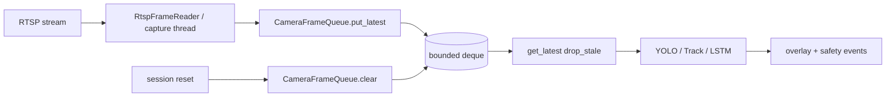

# Latest-Frame Queue: 지연 누적보다 실시간성을 선택한 이유

## 1. 문제 정의

관제 화면에서 중요한 것은 “과거에 무슨 일이 있었는가”의 완전한 재생이 아니라, **지금 카메라 앞에서 일어나는 일**을 가능한 한 작은 지연으로 보여주는 것이다.

RTSP 수신 스레드와 추론 스레드의 속도가 어긋나면 큐에 프레임이 쌓인다. 큐를 FIFO로 모두 처리하면 추론이 오래된 프레임을 따라잡느라 **표시 시각과 분석 시각이 점점 벌어지는** 체감 지연이 생긴다. 나는 이 문제를 “처리량 부족”만이 아니라 **큐 정책 선택**의 문제로 정의했다.

## 2. 기존 구조의 한계

초기/병렬 경로에는 단순 최신 프레임 큐(`stream/frame_queue.LatestFrameQueue`)와 RTSP 리더(`stream/rtsp_reader.RtspFrameReader`)가 있다. 캡처 스레드는 `put_latest`로 밀어 넣고, 소비 측은 `read_latest`로 꺼낸다.

한계는 두 가지였다.

1. **메타데이터 부재**: raw ndarray만 있으면 이후 overlay·event에 `frameId`/`capturedAtMs`를 일관되게 실을 수 없다.
2. **세션 경계 미반영**: 소스 전환 후에도 큐에 남은 프레임이 다음 세션 추론에 섞일 수 있다.

운영 런타임은 `FramePacket` + `CameraFrameQueue`(`ai/ai/frame_sync.py`)로 확장되었다. 여기에도 “가득 차면 오래된 것을 버리고 최신을 유지”하는 정책이 명시되어 있다.

## 3. 내가 확인한 근거

### 코드에서 확인된 사실

- `CameraFrameQueue.put_latest`: `deque(maxlen=...)`에 append. 용량 초과 시 가장 오래된 패킷이 밀려 나가고 `queue_overflow_drop_total`이 증가한다.
- `CameraFrameQueue.get_latest(drop_stale=True)`: 큐에 여러 개가 있으면 **최신 하나만 남기고 앞쪽을 버린 뒤** pop한다.
- `max_packet_age_ms`가 설정되면 `_drop_aged_locked`가 `captured_at_ms` 기준 오래된 패킷을 제거한다.
- `clear()`는 세션 경계에서 큐를 비우고 개수를 반환한다.
- 더 단순한 경로: `RtspFrameReader._run` → `LatestFrameQueue.put_latest` → `read_latest`.

### 문서에서 확인된 판단

- `ai/docs/frame_sync_debug.md`: put 시 oldest drop, get 시 stale drop을 운영 전제로 기술.
- Multi-cam 문서/슈퍼바이저 문서: 실시간성 위해 aged packet drop 옵션을 언급.

### 추가 확인이 필요한 부분

- 특정 GPU 환경에서 drop 비율 대비 탐지 누락 트레이드오프의 **현장 측정 수치**는 이 문서에 적지 않는다. 오프라인 테스트는 큐 동작을 검증하지, 초당 드롭 비율을 서비스 KPI로 확정하지 않는다.

## 4. 내가 한 판단

나는 **모든 프레임을 공정하게 처리하는 것**보다 **지금 시각에 가까운 프레임을 우선 처리하는 것**을 선택했다.

비교한 선택지:

| 선택지 | 장점 | 단점 | 결론 |
| --- | --- | --- | --- |
| 무제한 FIFO | 프레임 손실 최소 | 지연 누적 | 기각 |
| 고정 FPS 다운샘플만 | 단순 | 버스트 지연에 취약 | 보조 수단 |
| **Latest-frame + bounded queue** | 실시간성, 구현 단순, 메트릭 가능 | 과거 프레임 분석 누락 | **채택** |
| 오프라인 영상에서도 drop_stale | — | 벤치/재현성 훼손 | 실시간만 True |

오프라인 파일 재생에서는 모든 프레임이 필요할 수 있어, 런타임에서 `drop_stale`을 조건부로 끄는 경로가 있다(문서·코드 주석/설정 관례). 실시간 RTSP에서는 기본이 latest 우선이다.

## 5. 주요 구현과 핵심 함수

### `CameraFrameQueue.put_latest` — `ai/ai/frame_sync.py`

| 항목 | 내용 |
| --- | --- |
| 해결 문제 | 캡처가 추론보다 빠를 때 큐 폭주 |
| 입력 | `FramePacket` |
| 처리 | maxlen deque append; overflow 카운트 |
| 출력/상태 | 큐 길이 상한 유지, drop 카운터 증가 |
| 호출 | 캡처/리더 스레드 |
| 테스트 | `ai/tests/test_frame_queue.py`, `test_frame_sync.py` |

### `CameraFrameQueue.get_latest` — 동일 파일

| 항목 | 내용 |
| --- | --- |
| 해결 문제 | 추론 직전 백로그 제거 |
| 입력 | `drop_stale: bool` |
| 처리 | age drop 후, drop_stale이면 최신 1개만 남김 |
| 출력 | 최신 `FramePacket` 또는 None |

### `FramePacket` — 동일 파일

| 필드 | 역할 |
| --- | --- |
| `frame_id`, `captured_at_ms` | 이후 evidence·overlay 동기화 키 |
| `stream_run_id`, `session_generation` | 세션 경계 이후 stale packet 차단 |

### `RtspFrameReader` — `ai/stream/rtsp_reader.py`

| 항목 | 내용 |
| --- | --- |
| 핵심 | OpenCV `VideoCapture` 루프 + `put_latest` |
| 부가 | RTSP 비밀번호 redaction (`redact_url`), TCP transport 옵션 |

## 6. 전체 데이터 흐름

## 7. 그로 인한 결과

- 추론이 밀릴 때 **표시/분석 대상이 “가장 최근 프레임” 쪽으로 수렴**한다.
- drop 카운터(`queue_overflow_drop_total`, `aged_packet_drop_total`, `dropped_frame_count`)로 **손실을 숨기지 않고 관측**할 수 있다.
- `FramePacket` 도입으로 latest 정책과 evidence 체인을 같은 객체에 묶었다.
- 세션 reset 시 `clear()`로 **이전 소스 프레임이 다음 세션으로 넘어가는 경로**를 줄였다.

측정하지 않은 것: “지연 N ms 개선” 같은 서비스 벤치 숫자는 여기서 주장하지 않는다.

## 8. 검증 방법

| 검증 | 상태 |
| --- | --- |
| `test_frame_queue.py` / `test_frame_sync.py` 단위 테스트 | 코드베이스에 존재 (오프라인 실행 가능) |
| Multi-cam isolation·session stale guards | 별도 테스트 스위트 (세션+큐 연동) |
| 실 4캠 RTSP 부하 드롭률 | **추가 확인 필요** (현장) |

## 9. 한계와 후속 계획

- Latest-frame은 **짧은 이상행동 순간을 큐에서 버릴 수 있다.** lifecycle·sequence buffer가 연속성을 보완하지만, 극단적 부하에서는 미탐 리스크가 남는다.
- age drop의 `max_packet_age_ms` 기본값 튜닝은 카메라·네트워크별 운영 지식이 더 필요하다.
- 증거 기반 사후 분석(클립/스냅샷)과 latest 정책은 목적 함수가 다르다. 실시간 경로와 evidence 경로는 분리 유지가 맞다.

## 근거 수준 요약

| 주장 | 수준 |
| --- | --- |
| put/get 시 oldest/stale drop | 코드에서 확인된 사실 |
| 실시간성 우선 정책 | 코드+문서에서 확인된 판단 |
| 현장 지연 N ms 개선 | 작성하지 않음 (측정 부재) |
