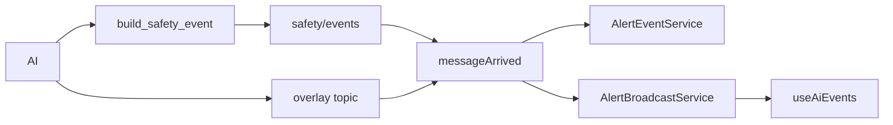

> **한 줄 결론**
>
> AI는 판정 메타를 MQTT로 보내고, **권한·scope는 Backend**가 결정한다.  
> Overlay(고주파)와 Safety Event(확정 알림)는 **토픽·핸들러를 분리**했다.

| 항목 | 내용 |
| --- | --- |
| 문제 | 프로세스 간 계약 붕괴 시 알림 누락·잘못된 수신자 |
| 판단 | ADR-002 + 3갈래 토픽 |
| 핵심 코드 | `build_safety_event`, `MqttSafetyEventSubscriber.messageArrived` |
| 결과 | 저장·브로드캐스트 분리, latency 로그 구간 |
| 검증 | AI/Back MQTT 테스트, Graphify 핵심 경로 |

## 문제 정의

AI·Spring·React는 프로세스가 다르다. 깨지기 쉬운 지점은 모델 정확도가 아니라 **topic·JSON·권한 계약**이다.

## 기존 구조의 한계

AI payload에 사용자/기관을 넣으면 경계가 흐려진다. Overlay와 Safety를 한 처리기로 섞으면 지연·저장 정책이 충돌한다.

## 내가 확인한 근거

### 코드에서 확인된 사실

- `build_safety_event` — schema/event_id/type/camera 등
- `messageArrived` — overlay topic / camera status / safety 분기
- `AlertEventService` + `AlertBroadcastService` — 영속화와 STOMP

### 문서에서 확인된 판단

- ADR-002 metadata separation, MQTT-Event-Schema

## 내가 한 판단

| 갈래 | 목적 |
| --- | --- |
| safety/events | 확정 이상행동 → DB + 알림 |
| camera overlay | 프레임 시각 메타 |
| cameras/status | 연결 상태 |

권한은 Backend camera registry만 신뢰한다.

## 주요 구현과 핵심 함수

- `build_safety_event` — `event_schema.py`
- `MqttSafetyEventSubscriber.messageArrived`
- Async 처리 → DB → WebSocket

## 데이터 흐름

## 그로 인한 결과

알림 권한과 AI 장애 도메인 분리. Overlay 폭주가 alert 테이블을 직접 오염시키지 않도록 분기 가능.

## 검증

| 검증 | 상태 |
| --- | --- |
| event_schema / subscriber 테스트 | 코드 존재 |
| 로컬 broker 없는 bootRun | 환경 의존 |

## 한계와 후속 계획

snake/camel 혼용 부채. 스키마 버전 수렴과 idempotency 테스트 지속 필요.
