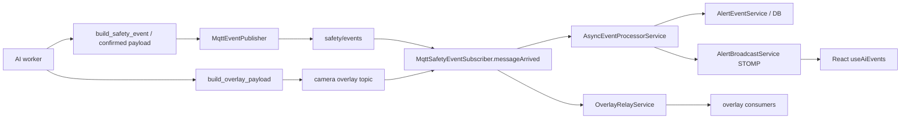

# MQTT 안전 이벤트 경로: AI 발행에서 WebSocket까지

## 1. 문제 정의

AI worker와 Spring Backend, React 대시보드는 프로세스가 다르다. 여기서 깨지기 쉬운 지점은 “모델 정확도”가 아니라 **계약**:

- 어떤 topic에
- 어떤 JSON 필드로
- 누가 권한·scope를 결정하고
- 누가 화면에 브로드캐스트하는가

계약이 흔들리면, AI가 맞아도 알림이 안 가거나 **잘못된 사용자에게** 간다.

## 2. 기존 구조의 한계

- AI payload에 사용자/기관 정보를 넣으면 권한 경계가 흐려진다 → ADR-002가 이를 분리한다.
- Overlay(고주파)와 Safety Event(확정 알림)를 한 토픽·한 처리기로 섞으면 지연·로깅·저장 정책이 충돌한다.
- 스키마 필드명이 snake_case / camelCase로 갈라지면 파서가 조용히 null을 만든다.

## 3. 내가 확인한 근거

### 코드에서 확인된 사실

**AI 발행**

- `build_safety_event` (`ai/messaging/event_schema.py`):  
  `schema_version`, `event_id`, `type`/`event_type`, `camera_id`, `timestamp`, `status`, `severity`, `message`, `source`, optional `track_id`, `confidence`, `bbox`, `model`, `evidence`, `metadata`.
- 상위 발행: `MqttEventPublisher` / `build_confirmed_event_payload` 계열 (`ai/ai/publishers/`).
- 토픽 관례: safety events vs overlay (설정·스펙 문서 `MQTT_TOPIC_SPEC.md`).

**Backend 수신** (`MqttSafetyEventSubscriber.java`)

- `messageArrived` (`@ServiceActivator` mqttInputChannel):
  1. topic이 `overlayTopic`(기본 `camera`)이면 `handleOverlayMessage` → overlay 경로.
  2. `safety/cameras/status`면 카메라 상태.
  3. 그 외 safety event → `SafetyEventDto` 파싱 → `handleSafetyEvent`.
- 로그에 `eventId`, `frameId`, `eventPhase`, realtime/evidence 구분, latency 구간 기록.
- 처리 체인은 `AsyncEventProcessorService` → 영속화(`AlertEventService`) → `AlertBroadcastService` (WebSocket/STOMP 알림).

### 문서에서 확인된 판단

- ADR-002: MQTT에는 AI 메타만, scope는 Backend camera registry.
- MQTT-Event-Schema: topic `safety/events`, 필수 식별자, 민감정보 금지.
- Graphify 검증: Schema 문서 ↔ `MqttSafetyEventSubscriber` 연결이 핵심 경로.

### 합리적 추론

- Overlay를 별도 topic/handler로 둔 것은 고주파 메타를 alert DB에 넣지 않기 위함이다.

## 4. 내가 한 판단

나는 **세 갈래 계약**을 유지하는 쪽을 선택했다.

| 갈래 | Topic/채널 | 목적 |
| --- | --- | --- |
| Safety event | `safety/events` (관례) | 확정 이상행동 → DB + 알림 |
| Overlay | `camera` (설정 가능) | 프레임 단위 시각 메타, 비영속 중심 |
| Camera status | `safety/cameras/status` | 연결 상태, overlay clear 트리거 |

그리고 ADR-002에 따라 **권한·기관 scope는 Backend resolve**만 신뢰한다. AI는 `camera_login_id` / stream 식별에 집중한다.

스키마 빌더는 `build_safety_event`처럼 **양립 필드(`type`과 `event_type`)** 를 허용해 FE/BE 혼재 기간을 견디게 했다. 이상적이진 않지만, 현장 브레이킹 체인지 비용을 줄이는 판단이다.

## 5. 주요 구현과 핵심 함수

### `build_safety_event` — `event_schema.py`

- 입력: event_type, camera_id, severity, message, track/confidence/bbox/evidence…
- 출력: dict payload
- 테스트: `test_event_schema.py` (backend-friendly fields)

### `MqttSafetyEventSubscriber.messageArrived`

- 입력: Spring Message (topic + payload)
- 분기: overlay / camera status / safety
- 부작용: async process, overlay relay, 로그

### `AlertBroadcastService` / `AlertEventService`

- 저장과 구독자 브로드캐스트 분리(알림 scope는 서비스 레이어 책임).

## 6. 전체 데이터 흐름

## 7. 그로 인한 결과

- AI 장애와 알림 권한 로직이 **프로세스 경계로 분리**된다.
- Overlay 폭주가 safety alert 테이블을 직접 오염시키지 않도록 분기할 수 있다.
- latency 로그 필드로 **구간별 지연 관측**이 가능하다(숫자 KPI 확정은 환경 의존).
- Wiki/Graphify에서 ADR → Schema → Subscriber 경로를 검증 대상으로 고정했다.

## 8. 검증 방법

| 검증 | 상태 |
| --- | --- |
| AI event_schema / mqtt publisher 테스트 | 코드 존재 |
| Backend MqttSafetyEventSubscriberTest 등 | 코드 존재 |
| 로컬 broker 없이 bootRun | DB/MQTT 미기동 시 실패 가능 (환경) |
| Graphify core path | 내부 검증 도구, CF에는 core만 |

## 9. 한계와 후속 계획

- snake/camel 혼용은 장기적으로 단일 스키마 버전으로 수렴해야 한다.
- `AlertEventService` 등 일부 클래스는 thin pilot 스캔에 없을 수 있어, **문서 relatedFiles와 실제 배포 트리 일치**를 주기적으로 맞춰야 한다.
- Idempotency(`EventIdempotencyStore`)와 lifecycle phase 필드가 버전마다 확장 중이라 계약 테스트를 지속 추가해야 한다.

## 근거 수준 요약

| 주장 | 수준 |
| --- | --- |
| Subscriber 토픽 분기 | 코드에서 확인된 사실 |
| ADR-002 metadata separation | 문서에서 확인된 판단 |
| 양립 필드 전략의 장기 최적성 | 합리적 추론 (기술 부채 포함) |
