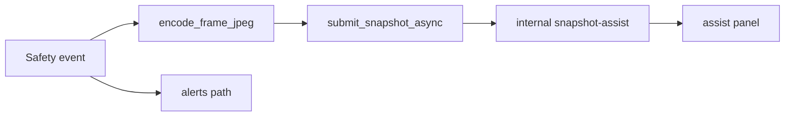

> **한 줄 결론**
>
> VLM은 사고를 **만드는** 주체가 아니라, 확정 이벤트에 대한 **설명 채널**이다.  
> 동기 VLM 호출로 알림 SLA를 막지 않도록 **JPEG side-channel**을 택했다.
> 원문 §8: 모달 우선순위 클립 VLM → 스냅샷 Gemini → 규칙 사유; Snapshot Assist 처리 중 **2초 폴링**; 라벨 **「AI 감지 근거」**.

| 항목 | 내용 |
| --- | --- |
| 문제 | 자연어 장면 설명 요구 vs 실시간 알림 SLA |
| 판단 | 이벤트 후 비동기 스냅샷 업로드 |
| 핵심 코드 | `submit_snapshot_async`, `SnapshotAssistService` |
| 결과 | 주 알림 경로와 실패 도메인 분리 |
| 상태 | **부분 구현** (로컬 파일 MVP) |

## 문제 정의

MQTT 알림은 “낙상 발생”을 빠르게 전하지만, 사후 검토는 장면 설명이 필요하다.  
주 파이프라인에 동기 VLM을 끼우면 timeout이 publish를 오염시킨다.

## 기존 구조의 한계

Incident VLM mock·RAG 실험은 있으나 실시간 알림과 책임이 다르다.

## 내가 확인한 근거

### 코드에서 확인된 사실

- `submit_snapshot_async` — fire-and-forget, 실패는 로그만
- API: `/api/internal/vlm/snapshot-assist/{eventId}`
- `SnapshotAssistStore` — 로컬 파일 상태 (DB-less MVP)

## 내가 한 판단

| 선택지 | 결론 |
| --- | --- |
| publish 전 동기 VLM | 기각 |
| 알림 텍스트를 VLM이 수정 | 기각 |
| **이벤트 후 side-channel** | **채택** |

## 주요 구현과 핵심 함수

- `encode_frame_jpeg` / `submit_snapshot_async`
- `SnapshotAssistController` / `Service` / `Store` / `Broadcast`

## 데이터 흐름

## 그로 인한 결과

주 알림과 VLM 설명의 실패 도메인 분리. 로컬 스모크 가능.

## 검증

| 검증 | 상태 |
| --- | --- |
| AI/Back/Front snapshot 테스트·스크립트 | 코드 존재 |
| 실 Gemini 품질 벤치 | 검증 필요 |

## 한계와 후속 계획

S3 장기 보존·Incident VLM 폐루프·RAG 검색은 별 트랙. 프로덕션 VLM 정확도는 주장하지 않는다.
