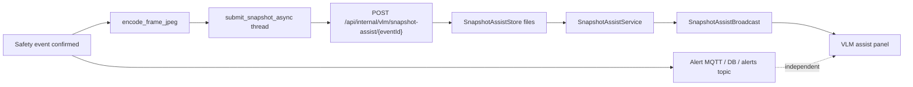

# Snapshot VLM Side-Channel: 알림을 막지 않는 보조 설명

> **상태: 부분 구현.** 실시간 안전 알림의 주 경로를 대체하지 않는다. 프로덕션 전 Gemini 품질·S3 원본 보존을 완료 구현으로 주장하지 않는다.

## 1. 문제 정의

MQTT 알림은 “낙상 발생”을 빠르게 전달하지만, 운영·면접·사후 검토에서는 다음 질문이 남는다.

- 그 순간 화면은 어땠는가?
- 자연어로 장면을 설명할 수 있는가?

이 요구를 **주 이벤트 파이프라인에 동기 VLM을 끼워 넣는 방식**으로 풀면, VLM 지연·장애가 낙상 알림 SLA를 오염시킨다.  
나는 문제를 “VLM을 넣을까”가 아니라 **어디에 넣어야 알림을 해치지 않는가**로 정의했다.

## 2. 기존 구조의 한계

- Incident VLM 스케줄러·mock worker 스케폴드(`vlm/incident_pipeline.py`, `vlm_mock.py`)는 있으나 전 구간 실비전 LLM 폐루프는 부분적이다.
- DB-less RAG mock, pgvector 경로는 **검색 실험**에 가깝고, 실시간 알림 경로와 책임이 다르다.
- 이벤트 확정 후 동기 호출로 VLM을 붙이면 timeout이 publish를 막는다.

## 3. 내가 확인한 근거

### 코드에서 확인된 사실

**AI**

- `snapshot_assist_upload.py` 모듈 독스트링: *Async post-event JPEG upload… Does not create or mutate primary safety alerts.*
- `snapshot_assist_enabled`: env `VLM_SNAPSHOT_ASSIST_ENABLED` (default true-ish).
- `snapshot_assist_url`: `SNAPSHOT_ASSIST_BASE_URL` / `BACKEND_BASE_URL` + `/api/internal/vlm/snapshot-assist`.
- `submit_snapshot_async`: daemon thread fire-and-forget; 예외는 로그만, 추론 루프에 raise하지 않음.
- `encode_frame_jpeg`: OpenCV JPEG encode.
- 토큰: `VLM_SNAPSHOT_ASSIST_SERVICE_TOKEN` 또는 `AI_SERVICE_TOKEN`.

**Backend**

- 패키지 `com.strange.safety.vlm.snapshotassist`:
  - `SnapshotAssistController` — internal API
  - `SnapshotAssistService` — 처리 (코드 주석: offline-safe SUCCESS path는 명시 enable 시에만)
  - `SnapshotAssistStore` — **로컬 파일** 상태 저장 (7일류 MVP 성격)
  - `SnapshotAssistBroadcastService` — STOMP 등 전달
  - `SnapshotAssistCleanupJob` — 정리

**Front**

- `verify-vlm-snapshot-assist.mjs` 계약 검증 스크립트.
- UI 패널 경로(스냅샷 어시스트)는 알림 피드를 대체하지 않는 부가 패널로 두는 방향.

### 문서에서 확인된 판단

- SMART_SAFETY_VLM / VLM-RAG 문서: 단계적 도입, mock/MVP 경계.

## 4. 내가 한 판단

| 선택지 | 결론 |
| --- | --- |
| 이벤트 publish 전 동기 VLM | SLA 위험 → 기각 |
| 알림 텍스트를 VLM이 생성·수정 | 주 경로 오염 → 기각 |
| **이벤트 후 JPEG side-channel + internal API + 로컬 스토어 MVP** | 채택 |
| 즉시 S3+프로덕션 VLM | 나중 단계 (부분) |

판단 문장:

> VLM은 사고를 “만드는” 주체가 아니라, 이미 확정된 이벤트에 대한 **설명 채널**이어야 한다.

## 5. 주요 구현과 핵심 함수

### `submit_snapshot_async` — AI

- 입력: event_id, camera_login_id, jpeg_bytes.
- 처리: 백그라운드 스레드에서 multipart POST.
- 실패: warning log only.

### `SnapshotAssistService` — Backend

- 업로드 수신, 상태 기록, (설정 시) 브로드캐스트.
- 명시적 mock/offline success 경로와 실 VLM 호출을 섞어 쓰지 않도록 가드.

### `SnapshotAssistStore`

- DB 없이 파일 기반 상태 — 로컬/데모 친화, 다중 인스턴스 한계.

## 6. 전체 데이터 흐름

## 7. 그로 인한 결과

- 주 알림 경로와 VLM 설명 경로가 **실패 도메인상 분리**된다.
- 로컬 디스크 MVP로 Postgres/VLM 키 없이도 통합 스모크가 가능하다.
- “완전 지능형 검색 관제”를 주장하기 전에 **측로 구현을 코드로 고정**했다.

## 8. 검증 방법

| 검증 | 상태 |
| --- | --- |
| `test_snapshot_assist_upload.py` | 코드 존재 |
| Backend SnapshotAssist 테스트 | 코드 존재 |
| `verify-vlm-snapshot-assist.mjs` | 코드 존재 |
| 실 Gemini 품질 벤치 | 검증 필요 / 기본 경로 아님 |
| 다중 노드 스토어 일관성 | 한계 (로컬 파일) |

## 9. 한계와 후속 계획

- S3 원본·장기 보존은 별 트랙 (clip uploader와 혼동 금지).
- Incident 단위 VLM 파이프라인과 snapshot assist의 중복 책임 정리 필요.
- 자연어 사고 검색(RAG/pgvector)은 **별 문서·별 상태(부분 구현)** 로 유지.

## 근거 수준 요약

| 주장 | 수준 |
| --- | --- |
| 알림 비변조 side-channel | 코드에서 확인된 사실 |
| 로컬 파일 MVP | 코드에서 확인된 사실 |
| 프로덕션 VLM 정확도 | 추가 확인 필요 — 주장하지 않음 |
