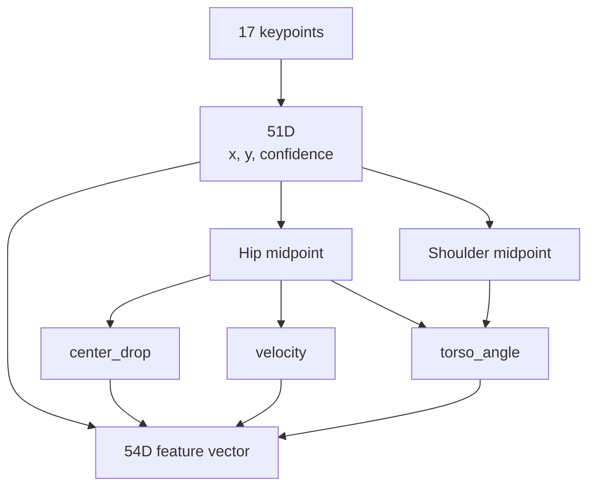

## 목적

51D keypoint feature와 54D feature 확장 구조를 실제 코드 경로 기준으로 비교·정리한다. LSTM이 어떤 feature를 입력으로 받는지, 각 차원이 어디에서 계산되는지 한 곳에서 확인할 수 있어야 한다.

## 배경

초기 설명에서 LSTM 입력은 17개 COCO keypoint의 `(x, y, confidence)`를 정규화한 51D였다. 실신은 정적인 자세만이 아니라 시간에 따른 중심 하강·속도·몸통 기울기 변화로 드러나므로, 최신 코드는 이 51D에 `center_drop`, `velocity`, `torso_angle` 3개의 handcrafted motion feature를 붙여 54D를 만든다.

51D와 54D의 성능 비교 수치는 아직 동일 조건에서 실험하지 않았다. 54D 확장 기능은 구현이 완료되었으나 성능 검증이 완료되지 않은 상태(Implementation Confirmed / Performance Unconfirmed)이다. 이에 따라, 기존 51D keypoint feature에 대해 측정된 1차 Baseline 및 불균형 대응 실험 지표를 기준점으로 기록한다.

## 핵심 내용

| Feature | Dimension | Source | 설명 |
| --- | ---: | --- | --- |
| keypoint x/y/conf | 51 | `keypoints_to_feature` | 17 COCO keypoints x 3 |
| center_drop | 1 | `append_motion_features` | hip midpoint y 변화량 |
| velocity | 1 | `append_motion_features` | hip midpoint frame-to-frame 이동 거리 |
| torso_angle | 1 | `append_motion_features` | shoulder midpoint와 hip midpoint로 계산한 torso angle |
| total | 54 | `sequence_to_features` | 51D + 3D |

확인된 코드 근거:

- `strange_ai/ai/action/classifier.py`: `KEYPOINT_FEATURE_DIM = 54`
- `strange_ai/ai/action/motion_features.py`: `append_motion_features(base_features)`가 `(seq_len, 51)`을 `(seq_len, 54)`로 확장
- `strange_ai/benchmark/compare_lstm_extractors.py`: `sequence_to_features`에서 `append_motion_features`를 호출
- `strange_ai/tests/test_lstm_extractor_comparison.py`: `(3, 54)` feature shape 테스트 존재

---

## 1. 51D Baseline 성능 지표 (YOLO26n-pose)
`lstm_sequence30_motion_features` 실험 결과에서 51D keypoint 입력만을 사용하여 학습된 LSTM 모델의 기준 성능이다 (threshold=0.5).

*   **Accuracy**: 0.884622
*   **Precision**: 0.168468
*   **Faint Recall**: 0.692810
*   **F1-score**: 0.271030
*   **Confusion Matrix**:
    *   True Normal, Pred Normal: 21,329
    *   True Normal, Pred Faint (FP): 2,616
    *   True Faint, Pred Normal (FN): 235
    *   True Faint, Pred Faint (TP): 530

---

## 2. 51D 클래스 불균형 완화 실험 지표 (Sequence 30)
`lstm_sequence30_error_analysis.md`에서 확인된, Faint 데이터 불균형 문제를 해소하기 위한 실험적 기법별 지표이다.

| 기법 (Metric) | Baseline CE | Weighted CE | Oversample (최종 권장) |
| :--- | :---: | :---: | :---: |
| **Accuracy** | 0.954373 | 0.926236 | 0.906119 |
| **Precision** | 0.000000 | 0.153846 | 0.125000 |
| **Faint Recall** | 0.000000 | 0.057143 | 0.100000 |
| **F1-score** | 0.000000 | 0.083333 | 0.111111 |
| **False Positives** | 0 | 22 | 49 |
| **False Negatives** | 36 | 66 | 63 |

*분석 결과:* Weighted CE 및 Oversample(Faint 50:50 복제)을 사용함으로써 "모두 Normal로 판정"하는 현상에서 탈출하여 실제 Faint를 탐지(최대 Recall 0.10)하기 시작했다.

---

## 입력

```text
base_features: (sequence_length, 51)
```

## 출력

```text
final_features: (sequence_length, 54)
```

## 동작 흐름



## 관련 파일

- `strange_ai/ai/action/classifier.py`
- `strange_ai/ai/action/motion_features.py`
- `strange_ai/benchmark/compare_lstm_extractors.py`
- `strange_ai/tests/test_lstm_extractor_comparison.py`

## 관련 문서

- [LSTM](LSTM.md)
- [AI-Pipeline](AI-Pipeline.md)
- [ADR-004-LSTM-Feature-Expansion](ADR-004-LSTM-Feature-Expansion.md)

## 주의사항

현재 운영 코드에는 54D Feature 구조가 표준으로 등록되어 활성화되어 있지만, 54D 모션 피처가 실시간 탐지에서 유발하는 Precision/Recall 변화를 검증할 수 있는 독립 평가 로그는 미비하다. 따라서 54D의 지표 상태는 **"구현 확인 / 성능 미검증 (Implementation Confirmed / Performance Unconfirmed)"** 상태이다.

## 후속 작업

1. 54D 모션 피처 활성화 스위치를 적용한 상태에서 `compare_lstm_extractors.py`를 실행하여 51D Baseline과 1대1 비교 지표를 획득한다.
2. `velocity`, `center_drop` 등의 모션 피처가 오탐(False Positive)을 어느 정도로 상쇄해 주는지 Confusion Matrix 분석을 동반하여 검증한다.

---
#feature-vector #keypoint #51d #54d #motion-feature #lstm
