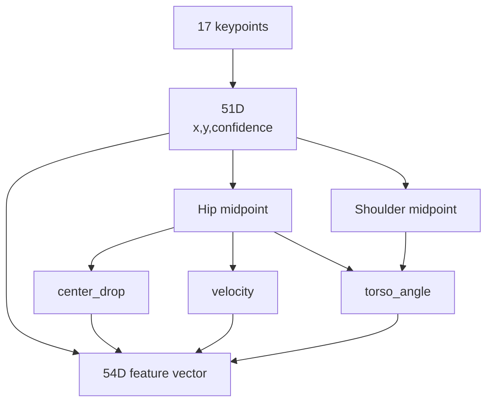

# Feature Vector 51D vs 54D

## 목적

기존 51D keypoint feature와 현재 54D feature 확장 구조를 실제 코드 기준으로 정리한다.

## 배경

초기 설명에서는 LSTM 입력을 17개 keypoint x `(x, y, confidence)`인 51D로 설명했다. 최신 코드에서는 이 51D에 3개 motion feature를 붙여 54D를 만든다.

## 핵심 내용

| Feature | Dimension | Source | 설명 |
| --- | ---: | --- | --- |
| keypoint x/y/conf | 51 | `keypoints_to_feature` | 17 COCO keypoints x 3 |
| center_drop | 1 | `append_motion_features` | hip midpoint y 변화량 |
| velocity | 1 | `append_motion_features` | hip midpoint frame-to-frame 이동 거리 |
| torso_angle | 1 | `append_motion_features` | shoulder midpoint와 hip midpoint로 계산한 torso angle |
| total | 54 | `sequence_to_features` | 51D + 3D |

확인된 코드 근거:

- `strange_ai/ai/action/classifier.py`: `KEYPOINT_FEATURE_DIM = 54`
- `strange_ai/ai/action/motion_features.py`: `append_motion_features(base_features)`가 `(seq_len, 51)`을 `(seq_len, 54)`로 확장
- `strange_ai/benchmark/compare_lstm_extractors.py`: `sequence_to_features`에서 `append_motion_features`를 호출
- `strange_ai/tests/test_lstm_extractor_comparison.py`: `(3, 54)` feature shape 테스트 존재

## 입력

```text
base_features: (sequence_length, 51)
```

## 출력

```text
final_features: (sequence_length, 54)
```

## 동작 흐름



## 관련 파일

- `strange_ai/ai/action/classifier.py`
- `strange_ai/ai/action/motion_features.py`
- `strange_ai/benchmark/compare_lstm_extractors.py`
- `strange_ai/tests/test_lstm_extractor_comparison.py`

## 관련 문서

- [LSTM](LSTM.md)
- [AI-Pipeline](AI-Pipeline.md)
- [ADR-004-LSTM-Feature-Expansion](ADR-004-LSTM-Feature-Expansion.md)

## 주의사항

51D와 54D 성능 비교 결과는 현재 로컬 artifact에서 확인하지 못했다. 확인된 것은 구조와 현재 코드 경로가 54D를 만든다는 점이다.

## 후속 작업

같은 split과 threshold에서 51D baseline과 54D feature 확장을 나란히 학습/평가해 Recall, Precision, F1, FP/FN을 비교한다.
