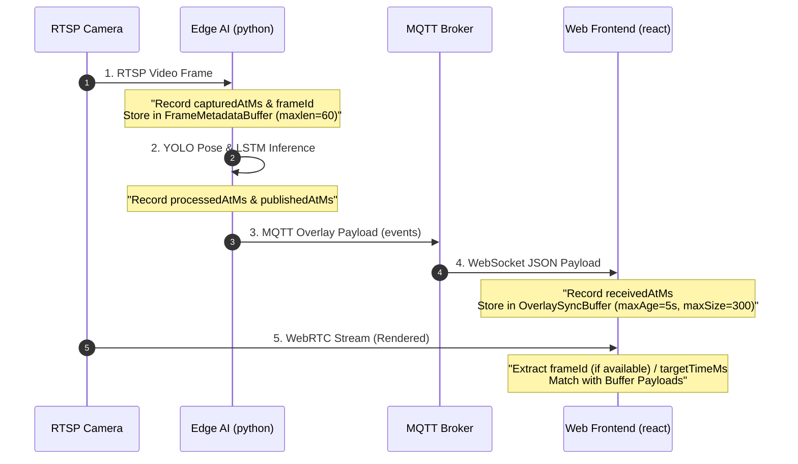

> **시작점:** [Frame-Sync-Canonical](Frame-Sync-Canonical.md). 본 문서는 버퍼·`select` 알고리즘 **Implementation** 상세다.

> 본 보고서는 Edge AI 패킷의 지연 시간 계산 방식, 버퍼의 메모리 관리(Pruning/Drop) 방식, 그리고 웹 프론트엔드에서 수신한 메타데이터와 WebRTC 비디오 프레임을 정밀하게 싱크하는 매칭 알고리즘을 상세히 설명합니다.

---

## 1. 프레임 동기화 전체 아키텍처

비디오 스트림 경로(WebRTC)와 메타데이터 경로(MQTT/WebSocket)의 물리적 속도 차이로 인해 발생하는 오버레이 밀림 문제를 방지하기 위해 다음과 같은 2단계 버퍼 구조를 사용합니다.



---

## 2. Edge AI (strange_ai) 버퍼 및 매칭 구조

### 2.1 버퍼 저장 위치 및 드랍 방식
- **저장소**: `strange_ai/ai/frame_sync.py`의 `FrameMetadataBuffer` 클래스 내 `_frames_by_camera` 속성에 저장됩니다.
  - 자료구조: `defaultdict(lambda: deque(maxlen=self.maxlen))`
  - 로컬 기본 크기: `maxlen = 60` (약 2초 분량의 프레임 정보)
- **드랍 (버리기) 방식**: 
  - Python의 `collections.deque`는 **고정 크기(FIFO) 링 버퍼**입니다.
  - 버퍼에 새로운 프레임 정보가 추가될 때 크기가 `maxlen`을 초과하면, 별도의 작업 없이 **가장 오래된(가장 앞에 있는) 프레임 데이터가 메모리에서 즉시 자동 누락(Drop)**됩니다.

### 2.2 지연 시간 매칭 방식
1. RTSP 프레임이 디코딩되어 들어올 때 `record_capture()`가 동작하며, 고유 `frameId`를 1씩 증가시키며 부여합니다.
2. AI 추론이 끝난 시점(`mark_processed`) 및 MQTT 발행 직전 시점(`mark_published`)에, 해당 `frameId`를 인덱스로 버퍼에서 해당 프레임 정보를 찾아 지연 시간을 계산합니다:
   - $\text{aiLatencyMs} = \text{processedAtMs} - \text{capturedAtMs}$
   - $\text{publishLatencyMs} = \text{publishedAtMs} - \text{capturedAtMs}$

---

## 3. Web Frontend (strange_front) 버퍼 및 매칭 구조

### 3.1 버퍼 저장 위치 및 드랍 방식
- **저장소**: `strange_front/src/shared/utils/overlaySync.ts`의 `OverlaySyncBuffer` 클래스 내 `buffers` 속성에 저장됩니다.
  - 자료구조: `Map<string, T[]>` (카메라 로그인 ID별로 페이로드의 자바스크립트 배열 관리)
- **드랍 (버리기) 방식**:
  - 버퍼 관리는 이벤트를 버퍼에 넣는 `push()` 또는 조회하는 `select()` 동작이 일어날 때 **실시간으로 2중 필터링**을 거칩니다:

```typescript
// 1. 시간 기반 드랍 (maxBufferAgeMs 초과 시 필터링)
private prunedBuffer(cameraId: string, nowMs: number): T[] {
  const minReceivedAt = nowMs - this.options.maxBufferAgeMs; // 기본 5,000ms (5초)
  return (this.buffers.get(normalizeCameraKey(cameraId)) ?? []).filter((event) => event.receivedAtMs >= minReceivedAt);
}

// 2. 개수 기반 드랍 (maxBufferSize 초과 시 shift)
while (buffer.length > this.options.maxBufferSize) { // 기본 300개
  buffer.shift(); // 가장 오래된 첫 번째 페이로드 제거 (Drop)
}
```

---

## 4. 프론트엔드 프레임 매칭 알고리즘

프론트엔드 UI는 비디오 프레임이 화면에 렌더링될 때, **WebRTC 디코딩 지연 시간 (`overlayDelayMs`, 기본 300ms)**을 감안한 타깃 가상 시간(`targetTimeMs = Date.now() - overlayDelayMs`)을 기준으로 버퍼에서 가장 일치하는 페이로드를 매칭합니다.

### 4.1 매칭 우선순위 (Decision Flow)

```
현재 화면 프레임 렌더링 시점
       │
       ▼
[1순위] 화면 프레임에 frameId가 포함되어 있는가?
  ├─► YES: 버퍼 내에서 frameId 차이가 가장 작은 페이로드 선택 (nearestByFrameId)
  └─► NO: [2순위]로 이동
       │
       ▼
[2순위] 캡처 시간 정보(capturedAtMs)가 페이로드에 존재하는가?
  ├─► YES: capturedAtMs와 targetTimeMs 차이가 가장 작은 페이로드 선택 (nearestByTime)
  └─► NO: [3순위]로 이동
       │
       ▼
[3순위] 수신 시간 정보(receivedAtMs)가 존재하는가?
  └─► YES: receivedAtMs와 targetTimeMs 차이가 가장 작은 페이로드 선택 (nearestByTime)
```

### 4.2 실제 매칭 소스코드 핵심

#### 1) Frame ID 기준 최소 오차 탐색 (`nearestByFrameId`)
화면상의 프레임 ID와 가장 가까운 버퍼 내 페이로드를 찾습니다.
```typescript
function nearestByFrameId<T extends OverlaySyncPayload>(buffer: readonly T[], frameId: number): T | undefined {
  if (buffer.length === 0) return undefined;
  return buffer.reduce<T | undefined>((best, event) => {
    if (event.frameId === undefined) return best;
    if (best === undefined || best.frameId === undefined) return event;
    // 오차가 더 작은 것을 선택
    return Math.abs(event.frameId - frameId) < Math.abs(best.frameId - frameId) ? event : best;
  }, undefined);
}
```

#### 2) 가상 타깃 시간 기준 최소 오차 탐색 (`nearestByTime`)
화면상의 렌더링 기준 타깃 시각 (`Date.now() - 300ms`)과 가장 오차가 작은 메타데이터를 찾습니다.
```typescript
function nearestByTime<T extends OverlaySyncPayload>(buffer: readonly T[], targetTimeMs: number): T {
  return buffer.reduce((best, event) => {
    const eventTime = event.capturedAtMs ?? event.receivedAtMs;
    const bestTime = best.capturedAtMs ?? best.receivedAtMs;
    return Math.abs(eventTime - targetTimeMs) < Math.abs(bestTime - targetTimeMs) ? event : best;
  }, buffer[0]);
}
```

> [!WARNING]
> **싱크 오차 경고 시스템 (Warning Flag)**
> 매칭이 완료되면 화면 렌더링 타깃 시간과 선택된 페이로드 시점 간의 절댓값 오차(`overlayTimestampDeltaMs`)를 계산합니다.
> 이 오차가 `matchThresholdMs` (기본 200ms)를 초과하면 화면 오버레이에 노란색 테두리 등 싱크 밀림 시각적 경고(Warning Flag)를 발생시킵니다.

---
#"Edge AI" #"frontend" #"frame-matching" #"buffer-mechanism" #"synchronization"
