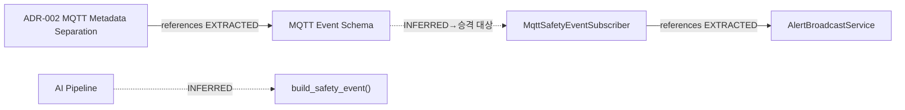

## 목적

Graphify를 **유지·도입**하되, 역할은 다음으로 고정한다.

| Graphify (내부) | Wiki / Cloudflare (공개) |
| --- | --- |
| 코드·문서 **일치 검증** | 사람이 작성한 `content/*.md` 가 진실 소스 |
| 변경 **영향 범위 추적** (`path` / `explain` / golden path) | 검수된 **core graph** 정적 자산만 배포 |
| 전체 그래프·INFERRED 감사 로그 | 방문자에게 full 2k-node 그래프 비공개 |

Graphify는 **Wiki 생성 도구가 아니다.** Cloudflare 빌드가 Graphify를 실행하지도 않는다.

## 배경 (파일럿 2026-07-11)

- 코드 그래프 ≈ 1,984 노드 → 의미 병합 후 2,057 노드 / 2,803 관계
- `EXTRACTED` ≈ 98% · `INFERRED` ≈ 2% (44 edges) · 외부 LLM API 0
- 핵심 검증 경로: **ADR-002 → MQTT Event Schema → MqttSafetyEventSubscriber**

## 운영 모델

```text
개발 중 (로컬/CI)
  graphify update / watch / query / path
  validate_core_paths · INFERRED 감사
        │
        │ promote gate 통과 시에만
        ▼
public/graphify/graph-core.*  →  Cloudflare Pages (정적)
```

1. **내부:** 전체 그래프 유지, 코드 변경 시 AST 갱신, 문서 계약 변경 시 semantic 보강  
2. **게이트:** golden path PASS + path leak 0 + core 노드 상한  
3. **공개:** `graph-core.html|json|mmd` 만 (`promote_core_to_wiki_public.py`)

## 핵심 검증 결과

| 항목 | 결과 |
| --- | --- |
| ADR-002 → MQTT Event Schema | **PASS** · `references` · EXTRACTED |
| MQTT Event Schema → MqttSafetyEventSubscriber | **PASS (soft)** · INFERRED (frontmatter 보정으로 이후 EXTRACTED 유도) |
| 의미 INFERRED 허위 연결 | **없음** |
| full `graph.html` 공개 | **금지** (로컬 path id, UI god-node 노이즈) |

## 핵심 경로 (공개용 Mermaid)



실선 = EXTRACTED, 점선 = INFERRED.

## Cloudflare에 올리는 것 / 올리지 않는 것

**허용 (검수 후)**

- `/graphify/graph-core.html` (정제 subgraph)
- 동일 디렉터리 `graph-core.json` / `graph-core.mmd`
- 이 문서의 Mermaid

**금지**

- 전체 `graph.json` / `graph.html` / `GRAPH_REPORT.md`
- 미검수 export, 절대경로·시크릿이 섞인 산출물

로컬 생성 위치(내부): 파일럿 `outputs/graphify-semantic/wiki-safe/`.  
배포 복사: `public/graphify/` — **promote 스크립트 경유만**.

## 개발자가 쓰는 법 (내부)

| 목적 | 명령·행동 |
| --- | --- |
| 영향 범위 | `graphify path "A" "B"` / `explain` |
| 계약 회귀 | `validate_core_paths.py` |
| 코드 변경 후 갱신 | `graphify update <root>` (API 비용 0) |
| 문서 relatedFiles 보정 후 | semantic refresh → 재검증 |
| CF 반영 | `promote_core_to_wiki_public.py` (게이트 실패 시 복사 안 함) |

상세 정책: 내부 `GRAPHIFY_OPS.md`.

## 포트폴리오 한 줄

> Graphify를 Wiki 생성기가 아니라 코드·문서 계약 검증·영향 추적 내부 도구로 두고, Cloudflare에는 검수된 core 그래프만 정적 배포한다.

## 주의사항

- Wiki 본문은 계속 손으로 유지한다. Graphify 출력을 문서 생성 결과로 취급하지 말 것.
- thin 스캔 루트로 “전체 시스템 커버”를 주장하지 말 것.
- INFERRED를 EXTRACTED처럼 포장하지 말 것.

---
#graphify #internal-tooling #mqtt #architecture #evidence #cloudflare
