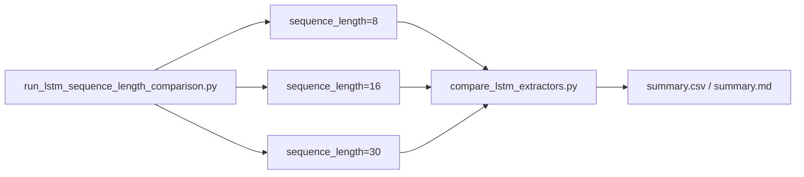

## 목적

YOLO26n-pose 기반 LSTM에서 sequence length 8, 16, 30 비교 결과와 현재 확인 상태를 기록한다.

## 배경

sequence length는 판단 지연과 행동 문맥 사이의 trade-off다. 짧은 window는 빠르지만 흔들릴 수 있고, 긴 window는 문맥이 늘지만 이벤트 확정이 늦어질 수 있다.

## 핵심 내용

로컬 `gpu_results_import` 폴더의 8/16/30 sequence length 비교 실험 결과를 정리한다.
평가는 크게 **주요 시퀀스 길이 평가 (Primary Evaluation)**와 **참조용 전체 데이터셋 평가 v2 (Full Dataset Evaluation v2)**로 구성된다.

### 1. Primary Sequence Length Evaluation (lstm_sequence_length_8_16_30)
`benchmark/results/lstm_sequence_length_8_16_30/summary.csv`에서 추출한 핵심 실험 결과이다. 세 가지 윈도우 크기 모두 성공적으로 완료되었다.

| sequence_length | status | Accuracy | Precision | Faint Recall | F1-score | FP | FN | generated_sequences | zero_sequence_clips | estimated_delay_frames | result path |
| ---: | --- | ---: | ---: | ---: | ---: | ---: | ---: | ---: | ---: | ---: | --- |
| 8 | OK | 0.900648 | 0.168476 | 0.550594 | 0.258005 | 16,006 | 2,647 | 187,746 | 4,391 | 8 | `.../lstm_sequence_length_8_16_30/sequence_length_8/` |
| 16 | OK | 0.905982 | 0.169060 | 0.517659 | 0.254879 | 10,302 | 1,953 | 130,347 | 5,296 | 16 | `.../lstm_sequence_length_8_16_30/sequence_length_16/` |
| 30 | OK | 0.875030 | 0.175649 | 0.822222 | 0.289462 | 2,952 | 136 | 24,710 | 8,051 | 30 | `.../lstm_sequence_length_8_16_30/sequence_length_30/` |

**실험 분석 및 규칙:**
- **Faint Recall & FN 최소화 (Sequence 30 권장)**: Sequence Length 30은 **Faint Recall이 0.822222**로 압도적으로 우수하며, 미탐(FN)을 단 136개로 억제한다. 오탐(FP) 역시 2,952개로 짧은 윈도우 대비 현격히 적어(8프레임의 약 1/5, 16프레임의 약 1/3 수준), 실전 관제 신뢰성을 극대화하기 위해 **Sequence Length 30을 표준으로 권장**한다.
- **지연 시간 감수**: Sequence Length 30은 약 1초(30프레임) 분량의 시퀀스를 누적해야 하므로, 지연 속도가 8프레임 및 16프레임 대비 각각 약 0.7초, 0.5초 길어진다.
- **짧은 윈도우의 한계**: 8프레임과 16프레임은 지연은 짧지만 과도한 오탐(FP 10,000건 이상)을 유발하고 Recall이 50%대에 머물러 단독 활용이 부적합하다.

---

### 2. Reference Full Dataset Evaluation (v2)
대규모 시퀀스 생성 중 자원 제약 상황을 반영한 추가 v2 실험 결과이다.
*주의: 이 v2 실험에서는 Sequence Length 8 세팅이 자원 초과로 실패(failed)하였다.*

| sequence_length | status | Accuracy | Precision | Faint Recall | F1-score | FP | FN | generated_sequences | zero_sequence_clips | estimated_delay_frames | result path |
| ---: | --- | ---: | ---: | ---: | ---: | ---: | ---: | ---: | ---: | ---: | --- |
| 8 | failed | - | - | - | - | 0 | 0 | - | - | 8 | `.../lstm_sequence_length_8_16_30_full_v2/sequence_length_8/` |
| 16 | OK | 0.969224 | 0.747801 | 0.056730 | 0.105459 | 86 | 4,240 | 140,565 | 3,550 | 16 | `.../lstm_sequence_length_8_16_30_full_v2/sequence_length_16/` |
| 30 | OK | 0.971874 | 0.816327 | 0.096970 | 0.173348 | 18 | 745 | 27,128 | 5,633 | 30 | `.../lstm_sequence_length_8_16_30_full_v2/sequence_length_30/` |

## 입력

- script: `strange_ai/scripts/run_lstm_sequence_length_comparison.py`
- expected metadata: `../ai_fall_experiments/data/metadata/metadata.csv`
- output dir: `benchmark/results/lstm_sequence_length_8_16_30` 및 `lstm_sequence_length_8_16_30_full_v2`
- lengths: `8`, `16`, `30`

## 동작 흐름

## 관련 파일

- `gpu_results_import/benchmark/results/lstm_sequence_length_8_16_30/summary.csv`
- `gpu_results_import/benchmark/results/lstm_sequence_length_8_16_30_full_v2/summary.csv`
- `strange_ai/scripts/run_lstm_sequence_length_comparison.py`

## 관련 문서

- [LSTM](LSTM.md)
- [LSTM-Experiment-Results](LSTM-Experiment-Results.md)
- [Benchmark-History](Benchmark-History.md)

## 주의사항

Sequence Length 30은 FP를 극적으로 상쇄하여 오보율을 낮추나, 1초 분량의 키포인트 축적 시간이 필요한 점을 파이프라인 설계 및 알림 발송 시 고려해야 한다.

## 후속 작업

가중치 CE(Weighted CE)나 Focal Loss 및 Oversampling 기법을 30프레임 설정에 결합하여 Recall 85% 이상, Precision 30% 이상을 확보할 수 있는 파라미터 조합을 탐색한다.

---
#lstm #sequence-length #benchmark #yolo26n #primary-evaluation #full-evaluation
