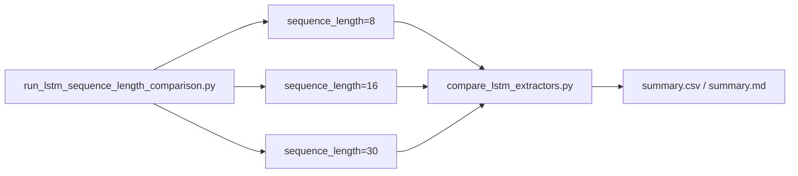

# LSTM Sequence Length Comparison

## 목적

YOLO26n-pose 기반 LSTM에서 sequence length 8, 16, 30 비교 결과와 현재 확인 상태를 기록한다.

## 배경

sequence length는 판단 지연과 행동 문맥 사이의 trade-off다. 짧은 window는 빠르지만 흔들릴 수 있고, 긴 window는 문맥이 늘지만 이벤트 확정이 늦어질 수 있다.

## 핵심 내용

로컬 `gpu_results_import` 폴더의 8/16/30 sequence length 비교 실험 결과를 정리한다.
평가는 크게 **Smoke Test**와 **전체 데이터셋 평가 (Full Dataset Evaluation v2)**로 나뉜다.

### 1. Full Dataset Evaluation (v2)
실제 대규모 데이터셋(총 14만 개 이상의 생성 시퀀스)을 기반으로 한 최종 평가 결과이다.
*주의: Sequence Length 8 실험은 메모리 초과(OOM)/시간 초과로 인해 실패(failed)하였다.*

| sequence_length | status | Accuracy | Precision | Faint Recall | F1-score | FP | FN | generated_sequences | zero_sequence_clips | estimated_delay_frames | result path |
| ---: | --- | ---: | ---: | ---: | ---: | ---: | ---: | ---: | ---: | ---: | --- |
| 8 | failed | - | - | - | - | 0 | 0 | - | - | 8 | `.../lstm_sequence_length_8_16_30_full_v2/sequence_length_8/` |
| 16 | OK | 0.969224 | 0.747801 | 0.05673 | 0.105459 | 86 | 4240 | 140,565 | 3,550 | 16 | `.../lstm_sequence_length_8_16_30_full_v2/sequence_length_16/` |
| 30 | OK | 0.971874 | 0.816327 | 0.09697 | 0.173348 | 18 | 745 | 27,128 | 5,633 | 30 | `.../lstm_sequence_length_8_16_30_full_v2/sequence_length_30/` |

**권장 규칙:**
- **Sequence Length 16**: Faint recall/F1 점수가 서로 인접한 상황에서 지연 속도와 컨텍스트(행동 흐름) 사이의 가장 합리적인 균형을 제공하므로 권장한다.
- **Sequence Length 8**: 가장 짧은 윈도우로 빠른 탐지가 가능하나 학습 중 OOM/실패 요인이 있어 대규모 학습이 불안정하다.
- **Sequence Length 30**: Faint recall(0.09697) 및 F1-score(0.173348) 측면에서 16 프레임 대비 오탐(FP=18 vs 86)을 대폭 줄이면서 Faint 검출력을 상대적으로 향상시키므로, 지연(30프레임)을 극복하고 오탐을 극한으로 억제해야 하는 특수 관제 환경에 유용하다.

---

### 2. Smoke Test Run
초기 검증을 위해 소규모 샘플로 수행된 연동 성능 테스트 결과이다.

| sequence_length | status | Accuracy | Precision | Faint Recall | F1-score | FP | FN | generated_sequences | zero_sequence_clips | estimated_delay_frames | result path |
| ---: | --- | ---: | ---: | ---: | ---: | ---: | ---: | ---: | ---: | ---: | --- |
| 8 | OK | 0.547945 | 1.000000 | 0.066038 | 0.123894 | 0 | 99 | 219 | 6 | 8 | `.../lstm_sequence_length_8_16_30/sequence_length_8/` |
| 16 | OK | 0.526316 | 0.000000 | 0.000000 | 0.000000 | 0 | 72 | 152 | 7 | 16 | `.../lstm_sequence_length_8_16_30/sequence_length_16/` |
| 30 | OK | 0.571429 | 0.000000 | 0.000000 | 0.000000 | 0 | 12 | 28 | 12 | 30 | `.../lstm_sequence_length_8_16_30/sequence_length_30/` |

## 입력

- script: `strange_ai/scripts/run_lstm_sequence_length_comparison.py`
- expected metadata: `../ai_fall_experiments/data/metadata/metadata.csv`
- output dir: `benchmark/results/lstm_sequence_length_8_16_30` 및 `lstm_sequence_length_8_16_30_full_v2`
- lengths: `8`, `16`, `30`

## 동작 흐름

## 관련 파일

- `gpu_results_import/benchmark/results/lstm_sequence_length_8_16_30_full_v2/summary.csv`
- `gpu_results_import/benchmark/results/lstm_sequence_length_8_16_30_full_v2/summary.md`
- `strange_ai/scripts/run_lstm_sequence_length_comparison.py`

## 관련 문서

- [LSTM](LSTM.md)
- [LSTM-Experiment-Results](LSTM-Experiment-Results.md)
- [Benchmark-History](Benchmark-History.md)

## 주의사항

Sequence Length 30은 오탐율을 줄이는 데 크게 유리하나(FP=18 vs 86), 30프레임(약 1초 지연)을 축적해야 하므로 실시간 이벤트 생성 지연이 16프레임 대비 약 0.5초 길어진다.

## 후속 작업

클래스 불균형에 대한 추가적인 완화(Oversample 등) 기법을 16/30 프레임 각각에 적용하여 윈도우 길이와 손실함수의 최적 조합을 연구한다.
