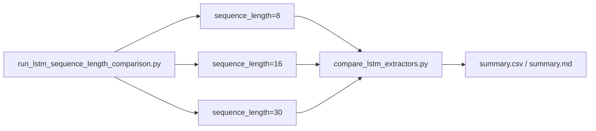

# LSTM Sequence Length Comparison

## 목적

YOLO26n-pose 기반 LSTM에서 sequence length 8, 16, 30 비교 결과와 현재 확인 상태를 기록한다.

## 배경

sequence length는 판단 지연과 행동 문맥 사이의 trade-off다. 짧은 window는 빠르지만 흔들릴 수 있고, 긴 window는 문맥이 늘지만 이벤트 확정이 늦어질 수 있다.

## 핵심 내용

현재 로컬에서 확인된 `benchmark/results/lstm_sequence_length_8_16_30/summary.csv`는 세 실험 모두 `missing_metadata` 상태다. 따라서 Recall, Precision, F1, FP/FN 수치는 임의 작성하지 않는다.

| sequence_length | status | Faint Recall | Precision | F1 | FP | FN | generated_sequences | threshold | result path |
| ---: | --- | ---: | ---: | ---: | ---: | ---: | ---: | --- | --- |
| 8 | missing_metadata | 미확인 | 미확인 | 미확인 | 0* | 0* | 미확인 | 미확인 | `benchmark/results/lstm_sequence_length_8_16_30/sequence_length_8/raw_result.json` |
| 16 | missing_metadata | 미확인 | 미확인 | 미확인 | 0* | 0* | 미확인 | 미확인 | `benchmark/results/lstm_sequence_length_8_16_30/sequence_length_16/raw_result.json` |
| 30 | missing_metadata | 미확인 | 미확인 | 미확인 | 0* | 0* | 미확인 | 미확인 | `benchmark/results/lstm_sequence_length_8_16_30/sequence_length_30/raw_result.json` |

`0*`는 평가가 성공해서 나온 FP/FN이 아니라, metrics가 비어 있을 때 summary wrapper가 채운 기본값이다.

## 입력

- script: `strange_ai/scripts/run_lstm_sequence_length_comparison.py`
- expected metadata: `../ai_fall_experiments/data/metadata/metadata.csv`
- output dir: `benchmark/results/lstm_sequence_length_8_16_30`
- lengths: `8`, `16`, `30`

## 출력

```json
{
  "sequence_length": 8,
  "status": "missing_metadata",
  "metadata_csv": "..\\ai_fall_experiments\\data\\metadata\\metadata.csv",
  "runtime_seconds": 0.0
}
```

## 동작 흐름



## 관련 파일

- `benchmark/results/lstm_sequence_length_8_16_30/summary.csv`
- `benchmark/results/lstm_sequence_length_8_16_30/summary.md`
- `strange_ai/scripts/run_lstm_sequence_length_comparison.py`

## 관련 문서

- [LSTM](LSTM.md)
- [LSTM-Experiment-Results](LSTM-Experiment-Results.md)
- [Benchmark-History](Benchmark-History.md)

## 주의사항

8/16/30 비교 결과를 모델 선택 근거로 쓰려면 metadata와 checkpoint가 있는 환경에서 다시 실행해야 한다. 현재 파일은 실행 실패 상태를 증명할 뿐 성능 비교를 증명하지 않는다.

## 후속 작업

GPU PC에서 동일 split, 동일 threshold audit, 동일 54D feature 기준으로 8/16/30 실험을 재실행하고 `summary.csv`, 각 length의 `summary.json`, `threshold_audit.csv`를 보존한다.
