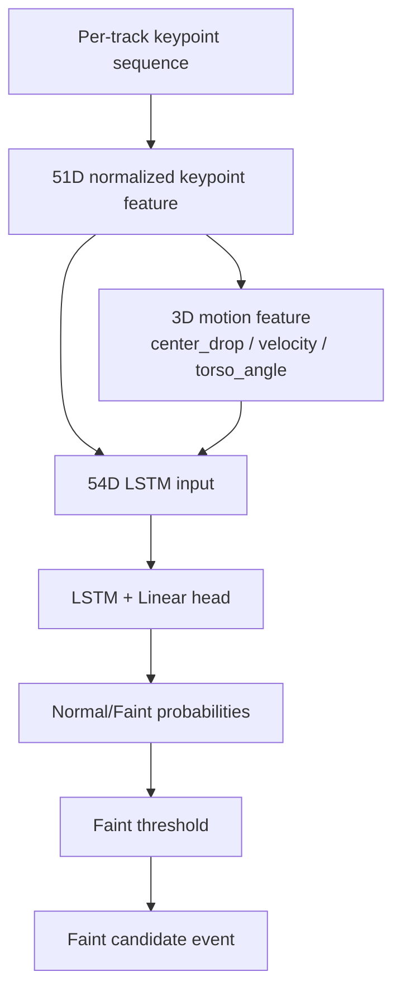

## 목적

YOLO26n-pose가 프레임 단위로 추출한 사람 keypoint 결과를 바로 이벤트로 판단하지 않고, track별 시간 흐름을 sequence로 묶어 `Normal/Faint`를 분류하는 LSTM 모듈의 구조와 설정을 한 곳에 정리한다.

구체적으로는 LSTM 입력 shape, sequence length, stride, class, threshold, feature dimension 개념과 51D·54D 구분을 다룬다. 이 문서는 발표자료나 포트폴리오에서 AI 판단 흐름을 설명할 때 참조 지점으로도 활용할 수 있다.

## 배경

AI worker는 frame 단위 YOLO 결과를 곧바로 이벤트로 만들지 않는다. 실신(Faint)은 단일 프레임의 자세가 아니라 시간에 따른 중심 하강, 속도 변화, 몸통 기울기의 흐름으로 드러난다. 따라서 track별 시간 순서의 keypoint sequence를 LSTM에 입력하고, LSTM이 `Normal/Faint` 확률을 산출한 뒤 threshold와 cooldown 정책을 적용해 최종 이벤트 후보를 만든다.

51D는 17개 COCO keypoint의 `(x, y, confidence)`를 정규화한 기본 입력이다. 54D는 여기에 `center_drop`, `velocity`, `torso_angle` 3개의 handcrafted motion feature를 추가한 확장 입력으로, 현재 운영 코드 기준 표준이다.

## 핵심 내용

현재 코드 기준 LSTM keypoint 입력은 54D다.

| 항목 | 값 | 근거 |
| --- | --- | --- |
| base keypoint feature | 51D | 17 keypoints x `(x, y, confidence)` |
| motion feature | 3D | `center_drop`, `velocity`, `torso_angle` |
| final keypoint feature | 54D | `append_motion_features(base_features)` |
| default sequence length | 30 / 15 통일 완료 | 모든 학습/실험/실가동 스크립트 및 버퍼 클래스 기본값을 30/15로 일치시킴 |
| class | `Normal`, `Faint` | classifier/default benchmark |
| threshold audit | 0.3, 0.4, 0.5, 0.6, 0.7 | benchmark output |

## 입력

```text
(batch, sequence_length, 54)
```

54D 구성:

```text
51D = 17 keypoints x (x, y, confidence)
 3D = center_drop + velocity + torso_angle
```

## 출력

```json
{
  "label": "Faint",
  "score": 0.82,
  "probabilities": {
    "Normal": 0.18,
    "Faint": 0.82
  }
}
```

## 동작 흐름



## 관련 파일

- `strange_ai/ai/action/classifier.py`
- `strange_ai/ai/action/motion_features.py`
- `strange_ai/benchmark/compare_lstm_extractors.py`

## 관련 문서

- [AI-Pipeline](AI-Pipeline.md)
- [Feature-Vector-51D-vs-54D](Feature-Vector-51D-vs-54D.md)
- [LSTM-Sequence-Length-Comparison](LSTM-Sequence-Length-Comparison.md)

## 주의사항

`sequence_length`는 FPS sampling이 아니라 한 번의 LSTM 판단에 들어가는 frame window 크기다. `sequence_stride`는 다음 sequence 시작 간격이다.

## 후속 작업

RTSP 운영 config, benchmark script, checkpoint metadata의 `input_size`와 `sequence_length`를 같은 inventory로 정리한다.

---
#lstm #sequence #threshold #normal #faint #feature-vector
