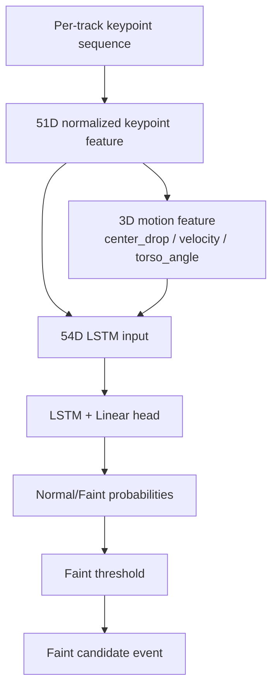

# LSTM

## 목적

LSTM 입력 shape, sequence length, stride, class, threshold, feature dimension 개념을 한 곳에 정리한다.

## 배경

AI worker는 frame 단위 YOLO 결과를 곧바로 이벤트로 만들지 않는다. track별 시간 흐름을 sequence로 묶고, LSTM이 `Normal/Faint` 확률을 낸 뒤 threshold와 cooldown 정책을 적용한다.

## 핵심 내용

현재 코드 기준 LSTM keypoint 입력은 54D다.

| 항목 | 값 | 근거 |
| --- | --- | --- |
| base keypoint feature | 51D | 17 keypoints x `(x, y, confidence)` |
| motion feature | 3D | `center_drop`, `velocity`, `torso_angle` |
| final keypoint feature | 54D | `append_motion_features(base_features)` |
| default sequence length | 8 또는 16 경로 혼재 | RTSP config는 8/4, `compare_lstm_extractors.py` 기본은 16/8 |
| class | `Normal`, `Faint` | classifier/default benchmark |
| threshold audit | 0.3, 0.4, 0.5, 0.6, 0.7 | benchmark output |

## 입력

```text
(batch, sequence_length, 54)
```

54D 구성:

```text
51D = 17 keypoints x (x, y, confidence)
 3D = center_drop + velocity + torso_angle
```

## 출력

```json
{
  "label": "Faint",
  "score": 0.82,
  "probabilities": {
    "Normal": 0.18,
    "Faint": 0.82
  }
}
```

## 동작 흐름



## 관련 파일

- `strange_ai/ai/action/classifier.py`
- `strange_ai/ai/action/motion_features.py`
- `strange_ai/benchmark/compare_lstm_extractors.py`

## 관련 문서

- [AI-Pipeline](AI-Pipeline.md)
- [Feature-Vector-51D-vs-54D](Feature-Vector-51D-vs-54D.md)
- [LSTM-Sequence-Length-Comparison](LSTM-Sequence-Length-Comparison.md)

## 주의사항

`sequence_length`는 FPS sampling이 아니라 한 번의 LSTM 판단에 들어가는 frame window 크기다. `sequence_stride`는 다음 sequence 시작 간격이다.

## 후속 작업

RTSP 운영 config, benchmark script, checkpoint metadata의 `input_size`와 `sequence_length`를 같은 inventory로 정리한다.
