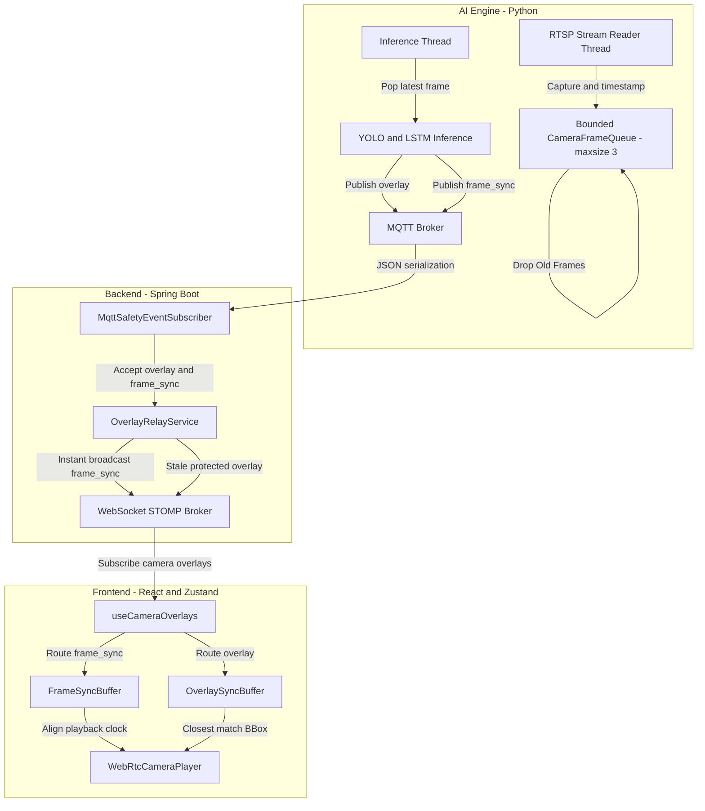

# 다중 카메라 RTSP 지연 방지 및 frameId 기반 동기화 구조 보고서

본 보고서는 다중 카메라 환경에서 실시간 RTSP 입력 프레임 지연을 해소하고, `cameraLoginId`와 `frameId` 기반의 지연 방지 및 overlay 동기화 구조를 안정화한 구현 내역을 요약합니다.

---

## 1. 문제 상황 및 원인 분석

1. **지연 누적 (Latency Accumulation)**:
   - 기존의 단일 루프 구조에서는 RTSP 프레임 디코딩, AI 객체 검출(YOLO), 자세 분석(LSTM), MQTT 전송이 순차적으로 이루어졌습니다.
   - 다중 카메라 구동 시 AI 추론 및 네트워크 지연이 발생하면 RTSP 버퍼에 과거 프레임이 누적되어 결과적으로 영상 대비 오버레이가 수 초 이상 늦게 렌더링되는 지연 현상이 점진적으로 심화되었습니다.

2. **동기화 정보 유실 (Synchronization Metadata Drop)**:
   - AI 엔진에서 `frameId`와 프레임 캡처 시점(`capturedAtMs`) 등을 발행하더라도, 백엔드 Java DTO의 엄격한 JSON 바인딩(정의되지 않은 필드 무시) 및 메시지 필터로 인해 프론트엔드로 전달되지 못하고 차단되었습니다.

3. **프론트엔드 단일 버퍼 한계**:
   - 다중 카메라 상황에서 개별 카메라의 프레임 흐름 및 동기화 상태가 구분되지 않고 단일 버퍼에서 공유되어 오버레이 매칭이 꼬이거나 오작동했습니다.

---

## 2. 주요 개선 아키텍처 및 구현 내용

지연 방지와 프레임 동기화를 위해 AI 엔진(Python) -> 백엔드(Java/SpringBoot) -> 프론트엔드(React/TypeScript) 전 구간의 파이프라인을 전면 리팩토링했습니다.

### 2.1. AI 엔진: 멀티스레딩 & Bounded Queue (Drop-Old 정책)
- **스레드 분리**: `serve_ai_overlay.py` 및 `run_rtsp_inference.py`에서 RTSP 프레임 캡처 스레드와 AI 추론 스레드를 분리했습니다.
  - **Reader 스레드**: 프레임을 읽어오는 즉시 캡처 시각(`capturedAtMs`)을 기록하고 `CameraFrameQueue`에 삽입합니다.
  - **Inference 스레드**: 큐에서 항상 가장 최신의 프레임을 가져와 추론함으로써 과거 백로그가 누적되는 현상을 차단합니다.
- **Bounded Queue**: `--frame-queue-maxsize` (기본값: 3)로 큐의 최대 크기를 제약하며, 큐가 가득 차면 가장 오래된 프레임을 즉시 버려 실시간성을 강제합니다.
- **지연 로그**: 큐에 대기한 시간(`queueLagMs`), 버려진 프레임 수, 추론 소요 시간(`inference_ms`)을 계산하여 주기적으로 로그로 출력합니다.
- **동기화 필드**: `frame_sync` 메시지를 별도의 가벼운 MQTT 페이로드로 발행하여 프레임 카운터와 실시간 통계를 전송합니다.

### 2.2. 백엔드: DTO 확장 및 프레임 동기화 릴레이 지원
- **DTO 확장**: `OverlayMessage.java` 및 `OverlayEvent.java`에 동기화 관련 필드(`frameId`, `capturedAtMs`, `processedAtMs`, `publishedAtMs`, `queueLagMs`, `droppedFrameCount`)를 수용할 수 있도록 레코드 정의를 확장하고 하위 호환성을 위한 부가 생성자를 보강했습니다.
- **`frame_sync` 즉시 전파**:
  - `MqttSafetyEventSubscriber.java`가 `"overlay"` 뿐만 아니라 `"frame_sync"` 메시지도 정상 수신하도록 허용했습니다.
  - `OverlayRelayService.java`에서 `frame_sync` 메시지는 내부 스냅샷 맵(`latestOverlays`)에 덮어쓰지 않고, 수신 즉시 프론트엔드로 브로드캐스트하여 오버레이 렌더링 흐름을 방해하지 않고 경량의 프레임 통계만 바로 전송하도록 최적화했습니다.

### 2.3. 프론트엔드: cameraLoginId별 독립 버퍼 및 매칭 알고리즘
- **Zustand 스토어 개선 (`overlayStore.ts`)**:
  - `cameraLoginId`별로 독립된 `FrameSyncBuffer` 및 `OverlaySyncBuffer`를 분리 유지하도록 저장 방식을 개선했습니다 (최대 버퍼 크기: 100).
- **데이터 라우팅 (`useCameraOverlays.ts`)**:
  - STOMP로부터 들어오는 메시지 타입(`frame_sync` / `overlay`)을 구분하여 각각의 버퍼에 수집하도록 수정했습니다.
- **재생 지연 동적 보정 및 매칭 (`CameraAiOverlay.tsx`)**:
  - HTML5 video 요소(WebRTC)의 렌더링 지연(약 350ms)을 감안하여, `Date.now() - PLAYBACK_LATENCY_OFFSET_MS` 기준과 가장 가까운 캡처 타임스탬프(`capturedAtMs`)를 가진 오버레이를 버퍼에서 탐색하여 화면에 렌더링합니다.
  - 디버그 모드(`VITE_FRONT_OVERLAY_SYNC_DEBUG=true`)에서 프레임 번호, 종단간 지연(e2e), 네트워크 지연(net), 큐 지연(queueLag), 드랍 수 등을 시각화하여 모니터링이 가능하도록 개선했습니다.

---

## 3. 검증 결과

1. **빌드 및 컴파일 안정성**:
   - Backend: Gradle Java 및 Test Java 컴파일 성공 (`BUILD SUCCESSFUL`).
   - Frontend: TypeScript 타입 체크 및 Production 빌드 성공.
2. **동기화 계약 및 작동 테스트**:
   - `npm run test:overlay-sync` 실행 결과, 44개의 contract 검증 및 behavior 시뮬레이션 테스트가 **모두 통과(PASS)하여 사양에 완벽 부합함을 확인하였습니다.**
