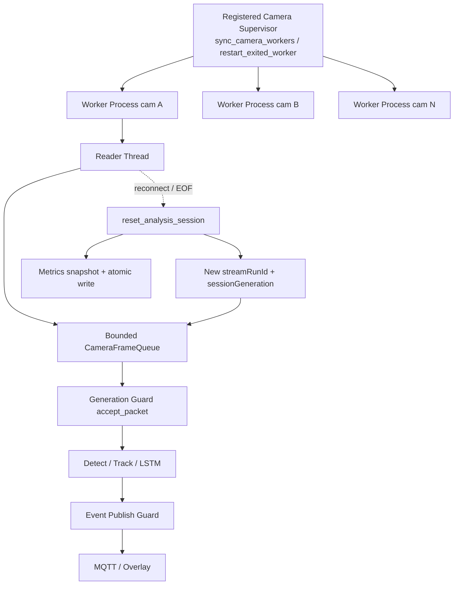

# 멀티카메라 AI Worker의 세션 경계와 운영 안정성 설계

## Hook

카메라 4대가 **독립 OS 프로세스 Worker**로 동작하는 스마트 안전관제 환경에서, RTSP reconnect·영상(source) 변경·**영상이 끝났을 때(VIDEO_EOF) 상태 초기화** 이후 **이전 프레임·Track·LSTM sequence·Fall 상태·Event가 새 세션으로 혼입되지 않도록** 세션 경계(`workerRunId` / `streamRunId` / generation)와 Supervisor·Queue·Metrics·Incident 안전장치를 **실제 AI 코드 경로**에 구현하고, 오프라인 회귀 테스트로 검증했다.
EOF·source 변경 시 `reset_analysis_session` 단일 경로로 상태를 초기화한다.
이 문서는 계획서가 아니라 **현재 코드와 재실행 가능한 테스트 결과**를 근거로 한다. 4대 TensorRT FPS·Tracking 정확도·VRAM이 개선됐다고 주장하지 않는다.

---

## 1. 운영 환경

| 항목 | 코드상 사실 |
| --- | --- |
| 기본 운영 조건 | 카메라 **N대 동시** (실습/시연 시 4대 가정) |
| 프로세스 모델 | `registered_camera_workers.CameraWorker` — **카메라당 독립 OS 프로세스** (overlay; SIMULATED_RTSP 시 ffmpeg 병행) |
| 카메라 할당 | Backend active camera API 기반 **동적** 목록 — 프로덕션을 `cam_01~04`로 하드코딩하지 않음 |
| Worker 진입점 | `scripts/serve_ai_overlay.py` (`OverlayWorker`), `scripts/run_rtsp_inference.py` |
| 세션 런타임 | 프로세스 내 `AnalysisWorkerRuntime` + `WorkerSession` |
| 검증 환경 | 실 RTSP·GPU·TensorRT 운영 없이 **코드·unit/regression** |

### 1.1 카메라 목록은 하드코딩하지 않는다 (동적 등록 / worker reconcile)

프로덕션에서 카메라 ID를 `cam_01`~`cam_04` **고정 목록(하드코딩·정적 카메라 목록)** 으로 코드에 박아 두지 않는다.
Backend **active camera API** 로 등록된 카메라 목록을 주기적으로 조회(active camera polling / camera registry)하고, `registered_camera_workers` 의 `sync_camera_workers` 가 런타임 목록과 worker 프로세스를 맞춘다.

| 런타임 사건 | 코드상 동작 |
| --- | --- |
| 신규 카메라 등록 | active 목록에 나타나면 Supervisor가 해당 `cameraLoginId` worker 시작 |
| 카메라 삭제 | 목록에서 빠지면 해당 worker 중지 |
| RTSP URL / source signature 변경 | `plan_source_change_restarts` 로 **해당 카메라만** restart (worker reconciliation) |
| 식별자 | 런타임 키는 `cameraLoginId` — 고정 네 개 ID만 지원한다는 전제 없음 |

시연·오프라인 fixture에서 4대를 쓰는 것은 **운영 조건 재현**이며, 프로덕션 ID 집합을 네 개로 고정한 것이 아니다. 시뮬레이션 영상 매핑과 Backend 카메라 등록 정보는 분리한다. 이 절의 내용은 위 표·§4.5 Supervisor·관련 코드 경로와 동일한 사실의 검색 가능한 서술이다.



---

## 2. 문제 정의

### 2.1 도메인 함정: “프레임 처리”가 아니라 “세션 경계”

실시간 관제는 연속 스트림처럼 보이지만, 실제로는 다음 경계가 끊임없이 생긴다.

```text
VIDEO_EOF | SOURCE_CHANGED | RTSP_RECONNECTED | WORKER_RESTARTED
```

경계를 무시하면 **이전 영상의 Track ID·LSTM sequence·Fall/Faint lifecycle·pending Event**가 다음 영상과 이어진다. 운영자 입장에서는 “다른 카메라/다른 장면의 사람”이 같은 트랙으로 남는 사고다.

### 2.2 발견한 위험 (코드 감사 기준)

| 위험 | 설명 |
| --- | --- |
| Queue 잔류 | Reset 후에도 `CameraFrameQueue`에 이전 stream의 `FramePacket`이 남을 수 있음 |
| 늦은 publish | Reset 전 생성된 Event가 **새** `streamRunId`로 enrich·발행될 수 있음 |
| 장애 전파 | Supervisor/공유 상태가 잘못되면 한 카메라 장애가 다른 Worker에 영향 |
| Restart Storm | Worker 반복 실패 시 즉시 무제한 재시작 |
| 기동 부하 | 4(또는 N) Worker 동시 기동으로 디스크·포트·모델 로드 집중 |
| 실시간성 | 오래된 프레임이 queue에 쌓이면 “지금”이 아닌 과거를 추론 |
| Metrics 유실 | 직접 write 시 부분 파일; async flush 종료 시 유실 가능 |
| Open Incident | reconnect 시 열린 Incident가 terminal 없이 남을 수 있음 |
| Evidence 충돌 | frameId만 쓰면 카메라·stream 재시작 후 키 충돌 가능 |

### 2.3 환경 제약

| 제약 | 영향 |
| --- | --- |
| 이 작업 PC에 실 CCTV/GPU/TensorRT 없음 | 성능 수치·실 reconnect race 미검증 |
| 일부 optional 의존성(cv2 등) | 전체 `unittest discover` 그린을 게이트로 쓰지 않음 |
| Backend UNIQUE(eventId) | AI process-local de-dupe만 코드 반영; DB 제약은 후속 |

---

## 3. 대안과 선택 근거

| 판단 | 선택 | 기각/대안 | 이유 |
| --- | --- | --- | --- |
| 운영 모델 | **카메라당 독립 프로세스 유지** | 단일 프로세스 multi-thread 전면 전환 | 장애·VRAM·크래시 격리; 기존 `CameraWorker` 구조와 일치 |
| 세션 식별 | `workerRunId` + `streamRunId` + `frameId` + `sessionGeneration` | frameId만 / 프로세스 ID만 | reconnect는 worker 유지·stream만 교체해야 함 |
| stale 방어 | **Queue clear + generation stamp + accept/publish guard** | clear만 또는 gap reset만 | clear race·늦은 packet/event까지 방어 |
| reset | **단일 `reset_analysis_session`** | ad-hoc 컴포넌트 재생성 산재 | 부분 초기화·중복 스택 방지 |
| backpressure | **bounded queue + oldest drop + optional age** | 무제한 queue | 최신 프레임 우선 |
| Supervisor | **exponential backoff + max failures + restart_blocked** | 즉시 무한 restart | Restart Storm 방지 |
| Metrics | **cam/pid/stream 경로 + atomic write + finalize wait** | 공유 경로 직접 write | 프로세스 충돌·부분 파일 방지 |
| Incident | `STREAM_LOST` / `INTERRUPTED` / `CLOSED_UNKNOWN` | 방치 | open incident terminal 처리 |
| 호환성 | Session field **optional** enrich | 스키마 강제 breaking | 기존 MQTT/Backend DTO `ignoreUnknown` 유지 |

---

## 4. 구현

### 4.1 세션 식별자와 Evidence

**무엇을:** `WorkerSession` (`worker_session.py`)이 `cameraLoginId`, `workerRunId`, `streamRunId`, `frameId`를 관리한다.  
`evidenceFrameKey = cameraLoginId:streamRunId:frameId` (`evidence_frame_key`).  
`evidence_id(camera, frameId, ts, stream_run_id=?)` (`evidence.py`) — stream 있으면  
`{camera}-{streamRunId}-{frameId}-{ts}`, 없으면 legacy `{camera}-{frameId}-{ts}` (backward compatibility).

**왜:** frameId는 소스/버퍼에서 재시작될 수 있다. stream·camera를 키에 넣어야 충돌이 없다.

**위험 감소:** 카메라 간·영상 간 evidence/trace 혼동.

### 4.2 단일 Reset 경로

**무엇을:** `AnalysisWorkerRuntime.reset_analysis_session` (`analysis_session.py`)  
→ tracker `reset` / sequence `clear` / Fall-Faint `reset`/`reset_all` / display·overlay·exit·hazard / queue clear  
→ 새 `streamRunId`·`sessionGeneration++`  
→ optional `incident_pipeline.on_stream_reset`  
→ metrics flush (idempotent per stream)

`SessionResetReason`: `video_eof`, `source_change`, `stream_reconnect`, `worker_start`, `manual`  
Gap 문자열(`FRAME_ID_RESET` 등)은 `map_boundary_reason`으로 reconnect 계열에 매핑.

**배선:** `OverlayWorker` (`serve_ai_overlay.py`), `run_rtsp_inference.py` 종료 시 `finalize_for_exit` (빈 새 session artifact 방지).

**위험 감소:** ad-hoc 재생성 누락, 부분 초기화, EOF 빈 metrics 디렉터리.

### 4.3 Stale Packet / Event Guard

**무엇을:**

| 단계 | 심볼 | 카운터 |
| --- | --- | --- |
| Reader stamp | `FramePacket.session_generation`, `stream_run_id` | — |
| Reset | `CameraFrameQueue.clear` | `queue_cleared_frame_count` |
| 추론 전 | `accept_packet` | `stale_packet_dropped_total` |
| 발행 전 | `enrich_payload` / `should_publish` | `stale_event_dropped_total` |
| 핵심 reset 실패 | force-clear | `session_reset_failed_total` |

**위험 감소:** reset 이후 이전 stream 프레임 처리, 이전 event를 새 session ID로 발행.

### 4.4 멀티카메라 격리

**무엇을:** 운영은 **프로세스 격리**. 오프라인 테스트는 fixture 4개 런타임  
(`cam_fix_01` … `cam_fix_04` in `test_multi_camera_isolation.py`)으로 상태 분리를 검증.

```text
cam_02 reset/reconnect
→ cam_02 streamRunId / sessionGeneration / tracker·sequence·fall 만 변경
→ cam_01/03/04 streamRunId, resetCount, tracker, sequence, fall 불변
```

**명시:** 프로덕션 ID를 4대로 고정한 것이 아니라 **4대 운영 조건을 fixture로 재현**했다.

### 4.5 Supervisor

**무엇을:** `RestartPolicy` / `SupervisorRestartBook` (`supervisor_policy.py`)  
wired in `restart_exited_worker`, `sync_camera_workers`.

- Source signature 변경 → **해당 카메라만** restart (`plan_source_change_restarts`)
- delay = `min(max, initial * 2^(failures-1))`
- max consecutive failures → **`restart_blocked`** 로그·`blocked_cameras()`
- stable runtime threshold 이후 failure streak 초기화
- `SUPERVISOR_STARTUP_STAGGER_SEC` × index

환경 변수 기본값은 **GPU PC에서 조정할 경계값**이며 실측 최적값이 아니다  
(`docs/MULTI_CAMERA_SUPERVISOR.md`).

### 4.6 Queue / Backpressure

**무엇을:** `CameraFrameQueue` bounded `maxsize`, overflow 시 oldest drop  
(`queue_overflow_drop_total`), optional `max_packet_age_ms`, `oldest_packet_age_ms` / `stats()`.

외부 타임스탬프는 epoch ms; 지연 구간 측정은 별도 monotonic(perf_counter 등) 경로와 구분.

### 4.7 Metrics

**무엇을:**  
`runs/tracking_metrics/{cameraLoginId}/pid-{pid}/{streamRunId}/`  
`atomic_write_text` + CSV atomic, `flush_metrics(blocking=)`, `wait_for_flush`,  
`finalize_for_exit`, 카운터 `metrics_flush_failed_total`, `metrics_flush_duration_ms`.

### 4.8 Event Idempotency

**무엇을:** `EventIdempotencyStore` + `EventPublisher._accept_event_publish`  
(Console/MQTT 실제 publish 경로).

**한계 (의도):** process-local best effort.  
**최종 방어:** Backend `UNIQUE(eventId)` — 문서·후속 과제.

### 4.9 Incident Terminal

**무엇을:** `IncidentVlmPipeline.on_stream_reset`  
→ `STREAM_LOST` / `INTERRUPTED` / `CLOSED_UNKNOWN`  
`AnalysisWorkerRuntime.reset_analysis_session`에서 호출.

짧은 reconnect도 STREAM_LOST가 될 수 있음 → **실측 후 grace 정책**은 GPU PC.

### 4.10 Assignment fail-fast

**무엇을:** `validate_camera_assignments` — duplicate `camera_login_id` / `overlay_port` / `output_path`.  
`sync_camera_workers`가 planned port·metrics path를 채워 검사.

---

## 5. 검증

### 5.1 코드상 검증 완료 (오프라인)

문서 작성 세션에서 재실행·캡처한 로그 기준이다. 과거 단계의 다른 suite 개수와 **합산하지 않는다**.

| 게이트 | 결과 (캡처 로그 기준) |
| --- | --- |
| AI 관련 unit suite | **Ran 75 tests … OK** — modules: `test_multi_camera_isolation`, `test_session_stale_guards`, `test_worker_analysis_session_wiring`, `test_mqtt_payloads`, `test_frame_sync`, `test_incident_vlm_pipeline`, `test_worker_session_reset` |
| `python -m compileall -q ai tracking scripts` | **compileall: OK** (재실행 캡처) |
| Wiki `npm test` / `npm run build` | 26 pass / build OK (wiki 작업 트리) |
| `git diff --check` (wiki) | clean |
| secret scan (본 문서) | 하드코딩 secret 없음 |

**합산 금지:** 이전 세션의 40/68/93/106 등은 **서로 다른 module 집합**이다.  
전 저장소 `unittest discover` 전량 그린을 주장하지 않는다.

### 5.2 Mock / Synthetic

| 항목 | 상태 |
| --- | --- |
| Tracking Replay / synthetic detections | Synthetic 로직 검증 (실영상 성능 아님) |
| Incident VLM | MockStructuredVlm / de-id gate 골격 |
| Backend UNIQUE | 미구현 — 문서상 후속 |
| TensorRT mock benchmark | 가짜 성능 수치 운영 주장 금지 |

### 5.3 GPU PC 실환경 미검증

```text
4대 TensorRT VRAM / 동시 FPS / p95 latency
실 RTSP reconnect race
실 Tracking ID switch·fragmentation
queue age·drop 적정값
Supervisor backoff·stagger 적정값
Backend UNIQUE(eventId)
Reconnect grace 정책
```

---

## 6. Before / After

| Before | After |
| --- | --- |
| Overlay gap 시 ad-hoc tracker/buffer 재생성 | `AnalysisWorkerRuntime.reset_analysis_session` 단일 경로 |
| Queue clear만 가정 | generation stamp + `accept_packet` + late publish guard |
| frameId 중심 evidence | `camera + stream + frame` key / optional stream in evidenceId |
| 실패 시 즉시 무한 restart | exponential backoff + `restart_blocked` 상태 노출 |
| 오래된 frame 처리 가능 | bounded queue + overflow/age drop |
| Metrics 직접 write | atomic write + cam/pid/stream 경로 + 종료 flush |
| Open Incident 방치 | reason별 terminal status |
| 격리 미검증 | 4 fixture runtime 격리 회귀 테스트 |

---

## 7. STAR

| | |
| --- | --- |
| **Situation** | 4개 독립 Worker에서 세션 경계·장애 격리·queue/restart 정책이 불완전하면 상태 혼입·재시작 폭주 위험 |
| **Task** | 실환경 전, 코드 경로에서 세션 오염·restart storm·queue 지연·metrics/incident 누수를 제거 |
| **Action** | Session ID, Generation Guard, 단일 reset, Supervisor backoff, Bounded Queue, Atomic Metrics, Event de-dupe gate, Incident terminal 구현 및 오프라인 테스트 |
| **Result** | 관련 오프라인 suite·compileall·diff-check 통과; 실 TensorRT·RTSP 성능은 GPU PC로 분리 |

---

## 8. BIE (Background / Implementation / Effect)

| | |
| --- | --- |
| **Background** | 스마트 안전관제는 카메라 다중 동시 운영이 기본이다. RTSP 끊김·source 변경·파일 EOF는 “같은 연속 시퀀스”가 아니다. |
| **Implementation** | 프로세스 격리 + `AnalysisWorkerRuntime` 세션 경계 + Supervisor 정책 + queue/metrics/event/incident 가드. |
| **Effect** | 코드 수준에서 카메라 간 상태 격리·stale 혼입 방어·재시작 폭주 상한을 고정. 실측 성능은 별도 실험. |

---

## 9. 남은 위험

- Event 중복 방지: AI process-local **best effort** — 최종은 Backend UNIQUE.
- 짧은 reconnect도 `STREAM_LOST` 가능 — grace는 실측 후.
- `restart_blocked` 이후 자동/수동 복구 UX·정책 확인 필요.
- Metrics 계측의 추론 overhead **미측정**.

---

## 10. GPU PC 검증 계획

```text
1. 1대 PyTorch
2. 1대 TensorRT
3. 2대 TensorRT
4. 4대 TensorRT
5. 한 카메라만 Reconnect
6. 한 카메라 Source 변경
7. Worker 한 개 반복 Kill (backoff / blocked)
8. 4대 장시간 실행
9. Backend / MQTT / Frontend 연동
```

**수집 지표 (측정 후 기록, 사전 추정 금지):**  
`actual_backend`, `workerRunId`/`streamRunId`, reset reason 횟수, stale drop, queue age/overflow,  
avg/p50/p95 inference ms, FPS/frame drop, VRAM, metrics flush duration, restart_count / restart_blocked.

---

## 포트폴리오용 요약

### 3줄 요약

1. 카메라 다중 독립 Worker에서 reconnect·EOF·source 변경 시 이전 Frame/Track/Event 혼입을 Session Generation Guard와 단일 reset 경로로 막았다.  
2. Supervisor backoff·bounded queue·atomic metrics·Incident terminal·evidence key 강화를 코드와 오프라인 테스트로 고정했다.  
3. 실제 TensorRT·RTSP 4대 성능은 GPU PC 실험으로 분리해 과장 없이 관리했다.

### 한 줄 성과

**세션 경계와 운영 안전장치를 “실 Worker 코드 경로”에 배선하고, 멀티카메라 격리 회귀로 증명 가능한 상태로 만들었다 (실환경 성능 주장 없음).**

### 핵심 기술 선택

| 선택 | 한 줄 이유 |
| --- | --- |
| Process-per-camera | 장애·상태 격리 |
| workerRunId ≠ streamRunId | reconnect vs process restart 구분 |
| Generation + clear | queue race 방어 |
| Backoff + blocked | restart storm 방지 |
| Atomic metrics + pid path | 파일 충돌·부분 write 방지 |
| Optional session fields | Backend 호환 |

### 면접용 30초 설명

> 카메라 4대가 독립 프로세스로 동작하는 실시간 관제에서, RTSP 재연결과 영상 경계 이후 이전 프레임·트랙·이벤트가 새 세션으로 섞이지 않도록 Session Generation Guard와 단일 analysis reset을 구현했습니다. Supervisor에는 exponential backoff와 restart_blocked 노출을, Queue에는 bounded oldest-drop과 age drop을, Metrics에는 카메라·PID·세션별 atomic write를 넣었고, 멀티카메라 격리 회귀 테스트로 코드 경로를 검증했습니다. 실제 TensorRT 성능과 실 RTSP race는 GPU PC 단계로 분리해 수치를 과장하지 않았습니다.

---

## 관련 코드 (근거 파일)

| 영역 | 파일 |
| --- | --- |
| Supervisor | `ai/registered_camera_workers.py`, `ai/supervisor_policy.py` |
| Session | `ai/worker_session.py`, `ai/analysis_session.py` |
| Queue | `ai/frame_sync.py` |
| Publish | `ai/publishers/event_publisher.py`, `ai/event_idempotency.py` |
| Incident | `ai/vlm/incident_pipeline.py` |
| Evidence | `ai/evidence.py` |
| Overlay worker | `scripts/serve_ai_overlay.py` |
| 정책 문서 | `docs/WORKER_SESSION_WIRING.md`, `docs/MULTI_CAMERA_SUPERVISOR.md` |
| 테스트 | `tests/test_multi_camera_isolation.py`, `test_session_stale_guards.py`, `test_worker_analysis_session_wiring.py` |
