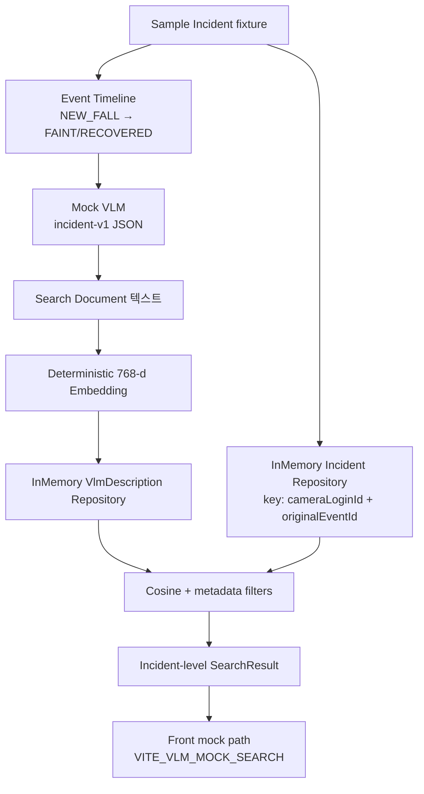

# DB 없이 검증한 VLM·RAG 사고 검색 Mock MVP

## Hook

GPU PC, 운영 PostgreSQL, S3, 외부 Vision API 없이도 **실제 `ai` / `back` / `front` 저장소** 안에서  
「샘플 사고 → Mock VLM → 검색 문서 → 임베딩 → cosine 검색 → UI 계약」  
수직 흐름을 반복 검증할 수 있게 만든 작업이다.

이 문서는 계획서가 아니라 **현재 코드와 재실행 가능한 테스트 결과**를 근거로 한다.  
실제 Gemini 분석, pgvector ANN, S3 미디어, GPU 추론이 끝난 것처럼 쓰지 않는다.

---

## Develop·draft hardening 정합 (2026-07-15)

- **코드 기준선**: [Develop-Code-Baseline-2026-07-15](Develop-Code-Baseline-2026-07-15.md)
- **골격 문서**: `back/SMART_SAFETY_VLM.md`, `ai/docs/SMART_SAFETY_VLM.md` (draft hardening; develop 머지 범위는 기준선 참고)
- **실험 원문**: `ai-pipeline-stabilization-source.md` (벤치·판단; Wiki canonical 페이지로 추출)

## 1. 문제 정의

### 1.1 무엇이 막혀 있었나

- VLM-RAG 알림 검색은 설계·판단 기록(`Evidence-VLM-RAG-Event-Search-Decision`)까지는 있었다.
- 그러나 **실제 레포의 ai/back/front를 한 줄로 이어 돌린 계약 검증**은 부족했다.
- 운영 DB·S3·GPU·Vision API를 한 번에 붙이면 실패 원인이 인프라/권한/모델/계약 중 어디에 있는지 분리하기 어렵다.

### 1.2 도메인 함정: Event 단위 검색

이상행동 알림은 보통 시간에 따라 이어진다.

```text
NEW_FALL → FAINT_SUSPECTED | FALL_UNRECOVERED → RECOVERED
```

Event 행을 그대로 임베딩·검색하면 같은 낙상이 **여러 건의 유사 사고**로 랭킹에 중복 노출될 수 있다.  
운영자가 원하는 단위는 “이벤트 로그 한 줄”이 아니라 **하나의 사고(Incident)** 다.

### 1.3 환경 제약

| 제약 | 영향 |
| --- | --- |
| 운영/실습 DB 데이터 공백 또는 AWS 의존 | JPA 풀스택 E2E 재현 어려움 |
| GPU 터미널·실 VLM 키 미사용 구간 | 영상 의미 분석 품질 검증 불가 |
| S3/미디어 파이프라인 미연결 | 실 키프레임·비식별화 미검증 |
| 로그인 계정에 facility/camera 미연결 가능 | 대시보드 실 API는 빈 목록이 정상일 수 있음 |

---

## 2. 대안 비교와 판단

| 대안 | 장점 | 단점 | 결론 |
| --- | --- | --- | --- |
| 문서만 보강 | 빠름 | 입출력 계약·타임라인 병합을 코드로 증명 못함 | 기각 |
| 별도 토이 프로젝트 | 인프라 자유 | 실제 strange 레포로 재이식 비용 | 기각 |
| 실 인프라부터 연결 | “진짜”에 가까움 | 현재 환경에서 불가·복합 오류 | 보류 |
| **실제 저장소 + Mock Adapter 수직 흐름** | 계약·도메인 모델을 코드로 고정, 재실행 가능 | 의미 검색 품질·실미디어는 후속 | **채택** |

### 선택 근거 (코드에 반영된 것)

1. **실제 `ai` / `back` / `front` 경로**에 Mock을 넣는다 (샘플 레포 분리 없음).
2. 검색 단위는 **Incident** — natural key = `cameraLoginId + originalEventId`.
3. **Mock VLM**으로 structured JSON 계약(`incident-v1`)을 고정한다.
4. **결정적 768-d embedding**으로 동일 입력 → 동일 벡터 재현성을 확보한다.
5. **In-memory repository**로 Spring DataSource/JPA 없이 백엔드 슬라이스를 실행한다.
6. 프론트는 `VITE_VLM_MOCK_SEARCH=true` 일 때만 fixture 경로 — **운영 semantic API 기본 경로는 유지**.

---

## 3. 기승전결 요약

| | 내용 |
| --- | --- |
| **기** | GPU·DB·S3 없이 “실제 저장소 기준” 수직 흐름을 검증할 수단이 없었다. |
| **승** | 실제 레포에 Mock Adapter를 얹고, 운영 경로와 env 플래그로 분리하기로 했다. |
| **전** | Incident 병합, Mock VLM, Search Document, 768-d embedding, cosine+필터, UI fixture를 연결했다. |
| **결** | 외부 인프라 없이 **재실행 가능한 Mock 수직 흐름**과 테스트 하네스를 확보했다. (실 VLM/DB/S3는 후속) |

---

## 4. STAR 요약

| | |
| --- | --- |
| **Situation** | 스마트 안전관제에 VLM 설명·의미 검색을 붙이려 했으나 인프라와 계약이 한꺼번에 얽혀 있었다. |
| **Task** | DB 없이 ai/back/front에서 사고 단위 RAG 검색의 **계약과 데이터 흐름**을 검증 가능하게 만든다. |
| **Action** | Incident natural key, Mock VLM JSON, deterministic embedding, in-memory search, front mock flag를 실제 패키지에 구현하고 테스트·데모 태스크를 붙였다. |
| **Result — 완료** | Mock 패키지·worker·fixture·Gradle mock 태스크·front opt-in 코드 존재. |
| **Result — Mock 검증 (이 세션 재실행)** | Backend mock 6 tests pass, `assemble` pass, mock demo pass; Python worker exit 0 + unittest 3 OK; front typecheck pass (mock flag/코드 존재 확인). |
| **Result — 미검증·후속** | 실 GPU VLM, RDS/pgvector, S3, 비식별 keyframe, 운영 semantic 검색 품질, 로그인 계정 시드 데이터. |

---

## 5. BIE 요약 (Background / Implementation / Effect)

| | |
| --- | --- |
| **Background** | Event 단위 검색 중복 위험 + 인프라 미가용 → 설계만으로는 계약 검증 불가. |
| **Implementation** | `com.strange.safety.vlm.mock.*`, `process_vlm_mock.py` / `vlm_mock.py`, `VITE_VLM_MOCK_SEARCH` fixture 경로. |
| **Effect** | 인프라 없이도 Incident 검색 계약·타임라인 규칙·DTO shape를 로컬에서 회귀 가능. 의미 품질·실미디어는 범위 밖. |

---

## 6. 최종 구조

### 6.1 데이터 흐름

```text
Sample Incident
→ Event Timeline
→ Mock VLM JSON
→ Search Document
→ Deterministic 768-d Embedding
→ Memory Repository (+ Front JSON fixture)
→ Cosine Search (+ metadata filter)
→ Incident 결과
→ Frontend Timeline / semantic panel (mock)
```

### 6.2 Mermaid



### 6.3 레이어별 실제 파일

| 단계 | 역할 | 주요 파일 |
| --- | --- | --- |
| Incident / Event 병합 | natural key 중복 방지 | `InMemoryIncidentRepository.java`, `Incident.java` |
| Fixture | 4개 샘플 사고 | `MockIncidentFixture.java`, `fixtures/vlm/demo_job.json`, `mockVlmIncidents.json` |
| Mock VLM | 타임라인 → structured JSON | `MockVlmClient.java`, `ai/vlm_mock.py`, `scripts/process_vlm_mock.py` |
| Search Document | 검색용 텍스트 조립 | `IncidentSearchDocumentBuilder.java` |
| Embedding | SHA-256 기반 768-d, L2 normalize | `MockEmbeddingRepository.java`, `vlm_mock.deterministic_embedding` |
| Search | cosine + camera/status/event/time 필터, incidentId dedupe | `MockSemanticSearchService.java` |
| Backend harness | JUnit runner / demo main | `MockVlmRagServiceTest.java`, `MockVlmRagTestRunner`, `MockVlmRagDemo`, Gradle `runMockVlmRagTests` / `runMockVlmRagDemo` |
| Front | opt-in mock semantic | `alertEventsApi.ts` (`VITE_VLM_MOCK_SEARCH`), `mockVlmIncidents.json` |

### 6.4 Incident 병합 규칙 (코드)

`InMemoryIncidentRepository.save`:

- natural key = `cameraLoginId + "|" + originalEventId`
- 동일 키가 이미 있으면 **기존 Incident를 반환** (새 ID로 늘리지 않음)

테스트: `MockVlmRagServiceTest.groupsEventsIntoOneIncidentWhenOriginalEventIdMatches`.

### 6.5 Mock VLM 계약 요약

- schema: `incident-v1`
- 타임라인 예: RECOVERED → `recoveryObserved=true`; FALL_UNRECOVERED → `riskLevel=CRITICAL`, 움직임 `low`
- Python worker: **stdout = JSON only**, 로그는 stderr (`process_vlm_mock.py`)

### 6.6 운영 경로와의 분리

| 경로 | Mock MVP | 운영(기존) |
| --- | --- | --- |
| Backend search | `MockSemanticSearchService` / mock demo·테스트 | `SemanticSearchService` + JPA `AlertEventDescription` |
| Embedding | `MockEmbeddingRepository` 768-d hash | `EmbeddingService` / provider 골격 (실 키 필요) |
| Front | `VITE_VLM_MOCK_SEARCH=true` → JSON fixture | 플래그 없음 → `/api/.../search/semantic` |
| DB | 사용 안 함 (in-memory) | PostgreSQL (실 데이터 필요) |

Mock은 **교체 경계**(VLM client / Embedding repo / Incident repo)를 인터페이스로 열어 둔 상태다. LangChain은 사용하지 않는다.

---

## 7. 구현 하이라이트

### 7.1 Backend mock 파이프라인

`MockIncidentFixture.load()`:

1. 4 Incident 저장  
2. `MockVlmClient.analyze`  
3. Search document + embedding 저장  
4. `MockSemanticSearchService` 구성  

### 7.2 AI mock worker

```text
python scripts/process_vlm_mock.py --job fixtures/vlm/demo_job.json
python -m unittest tests.test_vlm_mock_worker
```

### 7.3 Frontend mock

```text
VITE_VLM_MOCK_SEARCH=true
```

`fetchSemanticAlertEvents`가 실 API 대신 `mockVlmIncidents.json`을 읽어 semantic result shape으로 매핑한다.

---

## 8. 검증 근거 (이 세션에서 재실행)

### 8.1 테스트 존재 vs 통과

| 대상 | 존재 | 이 세션 통과 | 비고 |
| --- | --- | --- | --- |
| `tests/test_vlm_mock_worker.py` | ✅ | ✅ 3 tests OK | worker 스크립트 실실행 포함 |
| `process_vlm_mock.py` CLI | ✅ | ✅ exit 0 | stdout JSON |
| `MockVlmRagServiceTest` via `runMockVlmRagTests` | ✅ | ✅ **6 tests successful** | Gradle JavaExec |
| `runMockVlmRagDemo` | ✅ | ✅ BUILD SUCCESSFUL | 인메모리 검색 출력 |
| `assemble` | ✅ | ✅ BUILD SUCCESSFUL | |
| front `VITE_VLM_MOCK_SEARCH` 코드/fixture | ✅ | 구조 확인 + **typecheck exit 0** | 브라우저 E2E는 미실행 |
| 실 PostgreSQL / pgvector / S3 / GPU VLM | 골격·문서 일부 | ❌ 미검증 | 과장 금지 |

### 8.2 재실행 명령 (레포 상대 경로)

**AI**

```powershell
cd ai
python scripts/process_vlm_mock.py --job fixtures/vlm/demo_job.json
python -m unittest tests.test_vlm_mock_worker
```

**Backend**

```powershell
cd back
.\gradlew.bat runMockVlmRagTests
.\gradlew.bat assemble
.\gradlew.bat runMockVlmRagDemo
```

**Frontend (mock UI 경로)**

```powershell
cd front
# 환경 변수로 mock 검색 경로 활성화 후 dev 서버
# VITE_VLM_MOCK_SEARCH=true
npm run typecheck
```

### 8.3 상태 구분 한눈에

| 구분 | 내용 |
| --- | --- |
| **완료 (코드)** | Incident natural key, Mock VLM, 768-d mock embedding, search document, in-memory search, front opt-in mock, Gradle mock tasks, Python worker |
| **Mock 검증 (자동화)** | Backend 6 tests, assemble, demo; Python 3 tests + worker; front typecheck |
| **미검증·후속** | 실 VLM/GPU, RDS·pgvector, S3 asset, 비식별 keyframe, 검색 품질 지표(Hit@k), 실 API+로그인 데이터 E2E |

---

## 9. Before / After

| Before | After (Mock MVP) |
| --- | --- |
| 설계·판단 문서 중심 | 실제 레포에서 Mock 실행·테스트 가능 |
| 검증에 외부 인프라 필요해 보임 | DB/S3/GPU 없이 수직 슬라이스 검증 |
| Event 단위 시 중복 사고 검색 위험 | Incident 단위 + `originalEventId` natural key |
| 실 API 전 JSON/DTO 계약 미검증 | Mock VLM `incident-v1` + search DTO 검증 |
| 교체 경계 불명확 | VLM / Embedding / Repository 어댑터 분리 |
| front가 실 API만 가정 | `VITE_VLM_MOCK_SEARCH`로 UI 계약 선검증 |

---

## 10. 개선 효과

1. **원인 분리**: 인프라 장애와 계약/도메인 버그를 분리해 디버깅할 수 있다.  
2. **도메인 모델 고정**: “사고 단위 검색”을 테스트로 잠갔다.  
3. **재현성**: deterministic embedding으로 flaky 없는 단위 검증.  
4. **운영 안전**: mock 기본 경로를 production semantic API 기본값으로 바꾸지 않았다.  
5. **후속 작업 지도**: pgvector·S3·GPU worker를 꽂을 자리가 코드/문서에 드러난다.

---

## 11. 한계 (정직하게)

- Mock VLM은 **영상을 분석하지 않는다** (규칙/타임라인 기반).  
- Mock embedding은 **의미 검색 품질을 보장하지 않는다** (연결·필터·재현성용).  
- PostgreSQL / **pgvector** / S3 실연결은 이 MVP 범위에서 **검증하지 않았다**.  
- 실제 keyframe 추출·얼굴 비식별화·Vision API는 **미구현/미검증**.  
- cosine `minSimilarity` 운영 threshold는 **미확정**.  
- Front는 fixture/typecheck까지 — **브라우저 시나리오 E2E는 미실행**.  
- 로그인 계정에 facility·camera·alert 행이 없으면 실 API 대시보드는 비어 보이는 것이 정상일 수 있다 (Mock과 무관).

---

## 12. 다음 단계

1. Incident 영속화 (DB migration / JPA adapter)  
2. pgvector 컬럼 + ANN 검색 전환 플래그  
3. S3 Asset READY (clip/snapshot, 제한 시간 미디어 URL 발급)  
4. GPU worker job claim + 실 `process_vlm`  
5. Event-aware keyframe 선정  
6. 얼굴 비식별화 preview  
7. 실 Embedding SDK (직접 호출, LangChain 없음)  
8. 검색 평가 세트 (Hit@k 등)  
9. Frontend mock 플래그 끄고 실 semantic API 전환  
10. 시연용 facility/camera/user 시드  

관련 상위 판단 문서: `Evidence-VLM-RAG-Event-Search-Decision`.

---

## 13. 포트폴리오 요약

### 3줄 요약

1. GPU·운영 DB·S3 없이 **실제 스마트 안전관제 레포**에 VLM/RAG 사고 검색 Mock 수직 흐름을 심었다.  
2. Event가 아닌 **Incident(`cameraLoginId` + `originalEventId`)** 단위로 검색 중복을 막고, Mock VLM·768-d embedding·cosine 필터를 테스트로 고정했다.  
3. 의미 품질과 실인프라는 후속이며, 이 작업의 성과는 **재실행 가능한 계약 검증 하네스**다.

### 한 줄 성과

**인프라 없이도 “사고 단위 VLM 설명 → 검색” 파이프라인 계약을 코드와 테스트로 증명했다.**

### 핵심 기술 선택 표

| 선택 | 이유 | 비선택/보류 |
| --- | --- | --- |
| 실제 monorepo 폴더(ai/back/front) | 재이식 비용 제거 | 토이 레포 |
| Incident natural key | 타임라인 중복 검색 방지 | Event 단위 검색 |
| Mock VLM + deterministic 768-d | 계약·재현성 | 당장 실 Vision API |
| In-memory repository | DB 없이 슬라이스 검증 | 즉시 RDS 필수화 |
| env mock 플래그 (front/backend 분리) | 운영 경로 보존 | mock을 운영 기본값으로 고정 |
| pgvector (후속) | 기존 Postgres와 동일 권한 경계 | 별도 Vector DB 제품 선행 |
| SDK 직접 호출 방향 | 얇은 경계 | LangChain 파이프라인 |

---

## 14. 참고 명령 치트시트

```powershell
# AI mock
cd ai
python scripts/process_vlm_mock.py --job fixtures/vlm/demo_job.json
python -m unittest tests.test_vlm_mock_worker

# Backend mock (DataSource 불필요)
cd back
.\gradlew.bat runMockVlmRagTests assemble runMockVlmRagDemo

# Front mock search (UI)
cd front
# VITE_VLM_MOCK_SEARCH=true 설정 후
npm run dev
```
